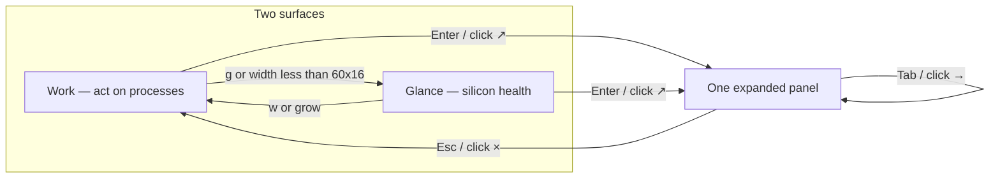

# Dashboard / UX rewrite — training-run cockpit

| | |
| --- | --- |
| **Status** | Draft (rev 2) |
| **Author** | plottypus design lead |
| **Date** | 2026-08-27 |
| **Audience** | Senior engineers implementing against this repo |
| **Companion law** | [`docs/UI-DESIGN.md`](../UI-DESIGN.md), [`docs/research/05-product-design.md`](05-product-design.md), [`docs/research/06-product-critique.md`](06-product-critique.md) |
| **Code freeze** | Design only. Do not implement from this file until the first PR in the plan is opened. |

This is the product + engineering plan for the next UX pass. It is opinionated on purpose. The user asked us to decide what they actually want, what is required, and what we will not do.

**Shipped** at `cc23f36`. The follow-up critique and next plan is
[`09-one-fact-one-home.md`](09-one-fact-one-home.md).

---

## Overview

plottypus already has the right two surfaces (Work / Glance) and the right compact rail (`cpu | gpu` over `mem | sens` over optional `net | disk`, process table on the right). The user who trains ML models on a Mac is not missing panels on the home pane. They are missing *interiors*, *cross-links*, and *temporal resolution*.

Today, expanding CPU is a silo: a 5-row "load" cell with one number, a pair of graphs, cluster bars, and no Super/Performance/Efficiency *histories*. Expanding sensors is a thermals-only silo: fans and °C, no utilization. Zone temps (`SensorsSnapshot::{e,p,s}_c` and `App::{e,p,s}_temp_history`) are collected and **never drawn** — `AppView::zone_temp_history` is defined and has no call sites. Compact sensors drop their graph on every terminal that is not huge, because `Degrade::for_left_rail` is `Minimal` at the common 80×24 Work size (left rail = 36 cols). Graphs update at 1 Hz with peak-only downsample, so braille jumps instead of scrolling. The contract in [`docs/UI-DESIGN.md`](../UI-DESIGN.md) still says "expanded views never degrade," which is exactly why expanded CPU/GPU paint cathedral-sized rectangles around a single token.

This rewrite keeps two surfaces, keeps the compact rail membership, and earns density only in expanded. Compact Work becomes a real training-run cockpit by *filling the panels we already have* — graph/spark visibility is a function of **panel inner height**, not rail `Degrade`. Expanded layout has one size brain: `grid::pack`. Expanded CPU, GPU, and SENS become one related family with hop navigation. Smoothness comes from faster *real* samples on cheap collectors (250 ms Mach / GPU% / mem / net / disk), not from tweening silicon we did not measure.

---

## Background & Motivation

### Who just used the app

Persona: trains a lot of ML models on Apple Silicon. Job on the home pane: "is this run on CPU, GPU, or is the machine cooking." Job on expand: "which cluster, how hot, are the fans keeping up, hop to the related story." They floated per-core mini-graphs and were not sure. That is a request for *resolution inside the CPU story*, not a request for 18 tiny charts.

### What the code actually does today

| Layer | Reality | File |
| --- | --- | --- |
| Surfaces | Work / Glance only. Work gate 60×16. | `crates/plottypus-core/src/surface.rs`, `crates/plottypus-ui/src/layout.rs` |
| Compact Work | Left rail `cpu\|gpu` / `mem\|sens` / `net\|disk`, proc 55% right | `layout.rs::work_plan` |
| Compact SENS graph | Only when `Degrade::Full` **and** inner height ≥ 2 | `widgets/fans.rs::render_compact` |
| Glance SENS | 3-row strip; inner height **1** after the border title; headline numbers only, **no spark** | `layout.rs::glance_plan`, `fans.rs` |
| Left-rail degrade | `<50×17` → Minimal, `<64×22` → Tight | `layout.rs::Degrade::for_left_rail` |
| 80×24 Work | `left_w = 80 − 44 = 36` cols → **Minimal**. SENS is a headline. MEM drops its graph. | `layout.rs` 111–118, 352–356; `mem.rs` / `fans.rs` |
| Expanded | `expanded_plan` assigns the whole body to one panel, `degrade = Full` always | `layout.rs::expanded_plan`; test `expanded_views_never_degrade` |
| Expanded body at 80×24 | `80×23` (`expand_fills_body`) | `layout.rs` |
| Expanded CPU | 5-row stat band of `kv_cell`s (load / optional power / clock / temp) + load/temp graphs + cluster cells with live bars + live core *numbers* | `widgets/expanded.rs::cpu` |
| Cluster load histories | **Do not exist.** Cluster % is live-only. | `app.rs::apply_snapshot` |
| Zone temp histories | Pushed on every live sample; `zone_temp_history` is **never called**. Live °C only in `cluster_cell`. | `app.rs`, `widgets/mod.rs` 138–144 |
| Headline CPU | Mach active. `scaled == active`. Watts / live MHz are `None`. | `metrics/src/cpu.rs`, ROADMAP Phase 1 |
| GPU | IOAccelerator `%` only. **Every** matching service is rematched every tick; `max(util)` wins. Watts / ANE / live MHz absent. | `metrics/src/gpu.rs` |
| Disk I/O | `io_bytes` rematches `IOBlockStorageDriver` and releases every service every sample; `getfsstat` every tick | `metrics/src/disk.rs` 212–237 |
| Temps / fans | SMC connection is process-lifetime; HID client **recreated every sample**; merged in `zones.rs` | `fan.rs`, `hid.rs`, `zones.rs` |
| Cadence | One `Sampler::tick()` does **everything** every `Config.interval` (default 1 s; cycle 500 / 1000 / 2000) | `worker.rs`, `sampler.rs`, `config.rs` |
| History | 900-cap, peak downsample to `2 × width`, 4-level bottom-fill braille | `core/src/history.rs`, `ui/src/braille.rs` |
| Draw | Once per interval or on input; DEC 2026 | `plottypus/src/app.rs`, `tui.rs` |
| Autoscale | `Scale::LOAD` / `TEMP` / `FAN` already shipped. Compact SENS still uses `Scale::Fixed(100.0)`. | `history.rs`, `fans.rs` |
| Honesty | Missing `Option`s stay off the board; history never gets `0.0` for a missing temp | `app.rs::push_temp`, UI-DESIGN §2 |

### Pain points (user review, mapped)

1. **Cockpit** — they want CPU + GPU + thermals/fans on one Work pane. The rail already has those four panels. The hole is SENS/MEM interiors collapsing whenever `Degrade` is not Full, and SENS compact using a 0–100 axis that flattens real 35–70 °C series. At 80×24 that `Degrade` is Minimal.
2. **Expand CPU** — cannot see thermals/fans or cluster *histories*. The 5-row load cell is the empty-rectangle bug in its pure form (`cpu_stats` + `kv_cell` at `Constraint::Length(5)`).
3. **Expand SENS** — cannot see CPU/GPU usage. Siloed.
4. **Laggy graphs** — 1 Hz samples + peak buckets + 4-level quantization. Not ratatui.
5. **Wasted space** — "expanded views never degrade" plus stat-first rows.
6. **Navigation** — Esc / ↗ / × is the whole hop language. Tab while expanded still walks compact `visible_panels()` even though only one panel is on screen.

### What they said vs what they want

| They said | They want | We ship |
| --- | --- | --- |
| "six or seven per-core mini graphs in a row" | See which *family* is doing the work, and that cores inside it are alive | Cluster load **histories** + live per-core **bars**. No per-core history mosaic. |
| "thermals and fan speeds on CPU expand" | Heat as part of the CPU story | Package + zone temp graphs + a related fan spark with hop to SENS |
| "CPU/GPU usage on thermals expand" | Context, not a second dashboard | Related CPU/GPU sparks on SENS, one hop away |
| "graphs feel laggy" | The line should *move* | 250 ms real cheap samples + two-tier downsample. No tween. |
| "large rectangles with one number" | Graph-first cells | Title carries the number; body is the graph |

---

## Goals & Non-Goals

### Goals

- Work compact is a training-run cockpit: CPU, GPU, thermals, fans simultaneously visible *and filled* at 80×24, 100×30, and 160×50.
- Expanded CPU tells one story: overall + cluster usage over time, zone heat, live cores. Related GPU/fan ride along.
- Expanded SENS tells one story: heat and air. Related CPU/GPU usage ride along.
- Hop between related expanded views without a third surface.
- Graphs scroll at the cheap-sample rate. Self-CPU stays under 2% (ROADMAP / PRD success gate).
- Empty-rectangle cells are a test failure.
- Honesty law intact: no invented watts, MHz, ANE, per-core °C, per-pid GPU, voltage.

### Non-goals (this design)

- IOReport (scaled vs busy, live MHz, PSTR / Energy Model watts, throttle marks). Explicit later unlock. Do not leave empty boxes "waiting for it."
- Per-core temperature. HID `eACC` / `pACC` / `PMU tdie` are **zone / package** sensors (`zones.rs`). Label them as zones.
- Per-core history graphs.
- New compact panels. New surfaces. Five presets.
- Tweened / interpolated silicon values.
- Fan control, per-pid GPU, Intel-first layouts, battery (still ROADMAP Phase 4, not this rewrite).
- Changing the crate direction (`core ← {metrics, ui} ← bin`).

---

## Key Decisions

These are locked by this document. They resolve the contradictions the prompt named.

### K1 — Compact membership does not change. Graph/spark visibility is inner height.

Work already has the cockpit panels. Adding a thermal pane or folding GPU into CPU would be kitchen-sink or a regression. Do not add a panel.

The 80×24 hole is `Degrade::Minimal` (left rail = 36 cols) causing SENS/MEM to drop their graph. **`Degrade` must stop meaning "no graph."** `Degrade` keeps controlling *spec lines only* (SoC name, mem wired/compr, CPU `4E + 8P`). Graph vs spark vs headline is a function of **that panel's inner height**:

| Inner height | SENS / MEM body |
| --- | --- |
| ≥ 5 | tall braille (`Scale::TEMP` / `Scale::Fixed(1.0)`) |
| 2–4 | 1-row spark (same scale) |
| 1 | headline numbers only |

At 80×24 Work the mid tile is ~6 rows (inner ~4) even when `Degrade` is Minimal — so SENS and MEM keep a spark. That is the cockpit fix. There is no "through Tight": Tight is never the 80×24 state.

### K2 — Density is earned in expand. Cross-link is not a kitchen sink.

Critique 06 remains law: we lose if we ship btop density on first paint. Cross-linking expanded views is permission to *relate stories*, not to tile every metric on Work. Compact stays calm. Expanded CPU/GPU/SENS become one family.

### K3 — One primary story per expanded panel. Related context hops.

| Panel | Primary story | Related (support, hoppable) |
| --- | --- | --- |
| CPU | How scheduled is the silicon, by cluster, and how hot are the zones | GPU util, fan |
| GPU | How scheduled is the GPU, and its die/zone °C | CPU util, SENS |
| SENS | Heat and air (zones, package, GPU °C, fans) | CPU util, GPU util |
| MEM | Capacity + pressure + composition | PROC (the act) |
| NET | Throughput | DISK |
| DISK | I/O bytes + volumes | NET |
| PROC | Who, then kill | none (this is the act surface) |

### K4 — No per-core history mosaic.

User floated it and deferred the call. Call: **out**. Cluster-level histories (E / P / S) are the deep-dive default. Live per-core bars stay. Rationale in §Cluster visualization. On an 0E+12P+6S machine, 18 mini graphs are unreadable at 80×24 and noisy at 160×50; 18 × 3600 × 4 B of extra rings plus 18 braille passes is the self-CPU risk we do not take.

### K5 — Zone temps are first-class on CPU and SENS. Never per-core °C.

`e_c` / `p_c` / `s_c` and their histories already exist. Draw them. Labels: `efficiency` / `performance` / `super` (or `eff` / `perf` / `super` in tight titles). Never `E0 42°`. HID `pACC` on a machine with `mACC` is Super (`zones.rs::hid_temp_zone`). SMC `Tp*` is package unless `Te*` exists.

### K6 — Autoscale stays. PRD 4.4 is updated to match shipped code.

`Scale::LOAD` (10% floor), `Scale::TEMP` (band), `Scale::FAN` already ship. They are correct. Compact SENS must switch from `Scale::Fixed(100.0)` to `Scale::TEMP`. PRD "auto-scale only net/disk" is stale law; keep the hint (`10%`, `45°`, `1.8k`) so a zoomed graph is not mistaken for 0–100.

### K7 — Smoothness without lying: faster real samples, no tween.

| Direction | Verdict |
| --- | --- |
| (a) 250 ms cheap collectors; SMC/HID/process slower | **Default.** This is the smoothness. |
| (b) Display-only column hold / sub-tick scroll of last sample | **Reject.** That is tweening. |
| (c) Taller graphs (more vertical braille bands) | **Yes**, via graph-first layout. Craft, not fiction. |
| (d) Downsample: right half last-value, left half peak | **Yes.** One algorithm, in `downsample_norm_range`, so braille *and* sparks share it. |
| (e) Redraw more often at 1 s samples | **Reject as the fix.** Cursor-only redraw does not move the line. |

Invented in-between silicon values are forbidden. Connecting last two *measured* points is what braille already does (two samples per cell). Holding a sample across unmeasured columns is forbidden. Work and Glance share the cadence.

Install default: **250 ms** for cheap collectors. User cycle is an explicit match `250 → 500 → 1000 → 250`. Process walk stays 1 s. SMC/HID/thermal stay 2 s. If the ignored macOS self-CPU bench on the reference M5 Pro exceeds 2%, a **documented follow-up commit** on the cadence branch flips the install default to 500 ms and leaves 250 as the first `[` `]` step. Do not silently drop back to 1 s. Do not change the default in the same commit as the cadence split.

### K8 — The packer is the only expanded size brain.

UI-DESIGN "expanded views never degrade" is the empty-rectangle law's enemy. Invert it. There is **no** `ExpandedDegrade` enum and no parallel size table that restates the packer. `grid::pack` plus the per-panel `Band[]` contracts below *are* the degrade ladder. `layout::expanded_plan` still assigns the whole body to one panel; it does not invent a degrade. Delete `expanded_views_never_degrade`.

### K9 — Graph-first cells. One title grammar.

macmon is right here. A cell titled `cpu  42%` can give 100% of its body to braille. A 5-row `load` cell with `42%` top-left is a bug. Related hops put `→` in the **cell** title.

**Panel** title (outer `panel_block`):

```
label  headline  [watts if Some]  [temp if Some]  [thermal if ≠ nominal]  [busy if scaled diverges]
```

Idle compact (no watts, nominal, Mach == scaled) is `cpu  62%  71°`. That is the three-token form. Extra tokens appear only when they carry information. Critique 06 decision 6 (`cpu  18%  8.2W`) is the idle form *when watts exist*; they do not today. Hollow tokens (`busy —`) are forbidden.

**Cell** title (inner `cell_titled`): `label  value  [→]` only.

### K10 — IOReport stays a later unlock. No placeholder cells.

ROADMAP Phase 1 still owns scaled, MHz, PSTR. Until those `Option`s are `Some` from a real collector, they stay off the board. Do not draw empty `power` / `clock` / `watts` frames.

### K11 — Headline `%` remains Mach-active until IOReport.

Do not relabel today's number as "scaled / how hard." Cluster graphs are **usage** (Mach busy). `busy` still rides along only when a real scaled figure diverges. Today it will not. That is honest.

---

## Information architecture

Two surfaces. Nothing else. Panel order unchanged: `cpu · gpu · mem · net · disk · sens · proc`.



### Compact Work — training-run cockpit

Disk is **off by default** (`Config.show_disk = false`). The mockup shows the optional disk tile dimmed.

```
╭─ cpu  62%  71° ──────────↗╮╭─ gpu  88%  64° ──────────↗╮╭─ proc  / train ──────────╮
│ ⣿⣿⣷⣧⣇⣀⠀⠀⠀⠀⠀⠀⠀⠀ ││ ⣿⣿⣿⣿⣷⣦⠀⠀⠀⠀⠀⠀⠀⠀ ││  PID  name      cpu  mem │
│ ⣿⣿⣿⣿⣿⣿⣷⠀⠀⠀⠀⠀⠀⠀ ││ ⣿⣿⣿⣿⣿⣿⣿⣷⠀⠀⠀⠀⠀⠀ ││ 904  python    612  18G  │
│ Apple M5 Pro  12P + 6S    ││ 16c                       ││ 312  WindowSer  5.2 312M │
├─ mem  28 / 48G  ● ───────↗┤├─ sens  71°  2140 rpm ───↗┤│  …                       │
│ ━━━━━━━━━━━────────────── ││ e 48°  p 62°  s 71°       ││                          │
│ ⣀⣠⣤⣶⣿⣿⣶⣤⣀⠀⠀⠀⠀⠀ ││ ⢀⣠⣤⣶⣿⣷⣤⣀⠀⠀⠀⠀⠀⠀ ││                          │
├─ net  en0  ↓1.2M ↑0.3M ──↗┤┊ disk off (s → 5)         ┊│                          │
│ ⣀⣀⣤⠀⠀⠀⠀⠀⠀⠀⠀⠀⠀⠀ │┊                           ┊│                          │
╰───────────────────────────╯╰───────────────────────────╯╰──────────────────────────╯
 ? help   / search   x kill   q quit
```

Net stays on. No new compact tiles. Slack still goes to the hero row (`cpu | gpu`).

What changes inside existing tiles:

- SENS/MEM body follows the K1 inner-height table. Axis for SENS is `Scale::TEMP`, not `Fixed(100)`.
- `Degrade` still hides spec lines (SoC name, `12P + 6S`, mem wired/compr) at Minimal.
- Panel titles follow K9. `nominal` still prints nothing.

### Compact Glance

Composition unchanged: CPU hero absorbs slack; gpu/mem, net/disk, sens pin to the bottom as 3-row strips. Same cadence as Work. No process table.

**Glance SENS decision:** keep **title + numbers**. A Glance fans strip is `Constraint::Length(3)`; after the bordered title the inner is 1 row. Today that row is `e/p/s` + rpm text (`fans.rs` takes the headline path when `height < 2`). Spending it on a `Scale::TEMP` spark would hide *which* zone is hot — the Glance job. Package °C and rpm already live in the title. Work compact (taller mid tile, inner ≥ 2) is where the thermal *shape* lives.

### Metric matrix

Roles:

- **hero** — owns the story; largest graph; stain + accent
- **support** — belongs to the story; smaller graph or strip
- **spark** — one-row related context; hoppable
- **omit** — not this surface / not this story / no honest source

| Metric | Work compact | Glance | Expand CPU | Expand GPU | Expand MEM | Expand NET | Expand DISK | Expand SENS | Expand PROC |
| --- | --- | --- | --- | --- | --- | --- | --- | --- | --- |
| CPU usage (Mach overall) | **hero** | **hero** | **hero** | spark | omit | omit | omit | spark | omit (table has per-pid) |
| CPU `busy` vs scaled | support if diverge | support if diverge | support if diverge | omit | omit | omit | omit | omit | omit |
| Super cluster usage | omit (expand) | omit | **hero** if present | omit | omit | omit | omit | omit | omit |
| Performance cluster usage | omit | omit | **hero** if present | omit | omit | omit | omit | omit | omit |
| Efficiency cluster usage | omit | omit | **hero** if present | omit | omit | omit | omit | omit | omit |
| Per-core live bars | omit | omit | support if `show_cores` + packer gives Cluster h≥8 | omit | omit | omit | omit | omit | omit |
| Per-core history | omit | omit | **omit** | omit | omit | omit | omit | omit | omit |
| SoC name / E+P+S counts | support spec (`Degrade`) | omit | omit (not a cell) | omit | omit | omit | omit | omit | omit |
| CPU package °C | support in title | support in title | **support** graph | omit | omit | omit | omit | **hero** graph | omit |
| Zone °C e/p/s | support as `e/p/s` numbers + spark if inner≥2 | **support numbers** (not a spark) | **support** graphs | omit | omit | omit | omit | **hero** graphs | omit |
| GPU util % | **hero** | support strip | spark | **hero** | omit | omit | omit | spark | omit |
| GPU °C | support in GPU title | support in GPU title | spark (in related gpu cell) | **support** graph | omit | omit | omit | **hero** graph | omit |
| Fan RPM | support in SENS title + spark if inner≥2 | support in title | spark | spark | omit | omit | omit | **hero** | omit |
| Thermal word | support in CPU title if ≠ nominal | same | support in CPU title | stain only | omit | omit | omit | support in title if ≠ nominal | omit |
| Watts / live MHz / ANE | omit unless `Some` | omit unless `Some` | omit unless `Some` | omit unless `Some` | omit | omit | omit | omit | omit |
| CPU voltage | **omit** | omit | omit | omit | omit | omit | omit | omit | omit |
| Per-pid GPU | **omit** | omit | omit | omit | omit | omit | omit | omit | omit |
| MEM used / total / pressure | **hero** | support strip | omit | omit | **hero** | omit | omit | omit | support col |
| MEM composition / swap | support specs (`Degrade`) | omit | omit | omit | support | omit | omit | omit | omit |
| NET rx/tx | support | support strip | omit | omit | omit | **hero** | spark | omit | omit |
| DISK I/O bytes | support if shown | support if shown | omit | omit | omit | spark | **hero** | omit | omit |
| DISK volume used | support bar | omit | omit | omit | omit | omit | support | omit | omit |
| Process table | **hero** (right) | omit | omit | omit | spark hop | omit | omit | omit | **hero** |
| Per-pid CPU spark | omit | omit | omit | omit | omit | omit | omit | omit | support in dossier |

Why the interesting omit/include cells:

- Cluster usage is omitted on compact. The cockpit question is "is the machine working." Which family is a dive.
- Zone °C *numbers* already appear on compact SENS (`named_temps`). Zone *graphs* are expand-only. Glance keeps the numbers; Work compact adds a spark when the tile is tall enough.
- CPU package °C rides in the compact CPU title (already) so the trainer sees heat without opening SENS. The Work SENS spark is the thermal *shape*.
- Watts/MHz/ANE are not "coming soon" tiles. They appear the day a collector returns `Some`.
- MEM does not grow CPU/GPU sparks. Memory pressure is a process problem; hop to PROC.
- PROC does not grow machine graphs. The dossier already has a per-pid spark.

---

## Proposed Design

### 1. Cross-link rule and hop navigation

**Rule.** A related metric may appear on another panel's expanded surface only as a *spark or secondary graph-cell* with a hop affordance. It never becomes a second hero. The expanded panel still has one primary story.

**Related families** (the only hop rings):

```text
silicon:  CPU ↔ GPU ↔ SENS
io:       NET ↔ DISK
act:      MEM ↔ PROC
```

No hop from CPU to PROC. That is "who," and it lives on Work. Esc home, then the table.

**Keys / mouse** (no new surface, no new overlay):

| Input | Compact | Expanded |
| --- | --- | --- |
| `Tab` / `Shift-Tab` | cycle panels (unchanged) | cycle the **related family** |
| `←` / `→` | unmapped (move stays `j/k`) | same as Tab / Shift-Tab |
| Click cell with `→` | n/a | hop to that panel |
| Click ↗ / Enter | expand focused | no-op (already expanded) |
| Esc / click × | close overlays | home |
| `j/k` | processes or cycle focus | no-op except expanded PROC |

Footer while expanded becomes: `tab related   esc home   q quit`.

**No module cycle.** `layout` stays packer-free and does not import `widgets`. Do not add `Hit::Hop` or `Hit::ExpandedCell`. Hop hit-testing lives next to paint:

```rust
// crates/plottypus-ui/src/widgets/expanded.rs
#[must_use]
pub fn hop_hit(area: Rect, view: &AppView<'_>, col: u16, row: u16) -> Option<Panel> {
    // rebuild the same Band[] the paint path used, pack(area.inner), hit-test hop cells
}
```

`App::on_click`, when `self.expanded.is_some()`, calls `hop_hit` **before** `layout::hit_test`. A `Some(panel)` hops.

`event.rs`: map `Left` / `Right` to `PrevPanel` / `NextPanel` **only** in `map_normal_key` (not search, not detail, not confirm). Today they are unmapped in normal mode.

`App::handle_normal`:

- `Event::NextPanel` / `PrevPanel` while `expanded.is_some()` call `hop_related(dir)` instead of `cycle_focus`.
- `hop_related` **must** set both `self.expanded = Some(p)` and `self.focus = Focus::from_panel(p)`. Today `NextPanel` only moves focus and leaves `expanded` on the old panel — that is the bug.

**Skip predicate** (not `LayoutFlags::visible` alone):

```rust
fn hop_ready(flags: LayoutFlags, panel: Panel) -> bool {
    flags.visible(panel) && hardware_present(flags, panel)
}

fn hardware_present(flags: LayoutFlags, panel: Panel) -> bool {
    match panel {
        Panel::Gpu => flags.has_gpu,
        Panel::Fans => flags.has_fans, // fans.is_present() || sensors.is_present()
        Panel::Disk => flags.has_disk,
        _ => true,
    }
}
```

`visible(Panel::Fans)` is only `show_fans` today — it does **not** consult `has_fans`. A fanless machine with no sensors must not hop to an empty SENS tile. GPU already requires `has_gpu` via `visible`.

**1-member rings are no-ops.** If after filtering the ring has length < 2 (NET with disk hidden and `show_disk` false; GPU hidden so silicon is CPU↔SENS — that is still 2), Tab / ← → do nothing. MEM↔PROC is always 2. Do not wrap a singleton onto itself.

Help overlay adds one line: `tab / ← →              related expand`.

### 2. Empty-cell law and expanded layout grammar

**Law.** A painted cell whose inner height is ≥ 3 and whose body is only a left-aligned number is a bug. Numbers live in titles. Bodies are graphs, bars, mosaics, or lists that fill.

Replace the informal `rows_of` / `cols_of` / `cell` / `graph_cell` / `kv_cell` stack in `expanded.rs` with an explicit packer.

New file: `crates/plottypus-ui/src/widgets/grid.rs`. Geometry only — no history, no ink, no scale.

```rust
#[derive(Clone, Copy, PartialEq, Eq)]
pub enum CellKind {
    Graph,    // title carries the live number; body is braille
    Spark,    // title + 1-row spark
    Cluster,  // % + zone ° in title, fill bar, optional live core mosaic
    List,     // volumes / readings / composition
}

pub struct CellTitle {
    pub label: &'static str,
    pub value: Option<String>, // "42%", "71°", "2140 rpm"
    pub hop: Option<Panel>,    // paints " →"; hop_hit uses this rect
}

pub struct CellSpec {
    pub id: u8,
    pub kind: CellKind,
    pub title: CellTitle,
    pub min: (u16, u16), // (cols, rows) including the cell border
    pub weight: u16,     // horizontal Constraint::Fill inside the band
    pub present: bool,   // false → not placed, no empty frame
}

pub struct Band {
    pub min_height: u16, // including cell borders; usually the max of members' min.1
    pub cells: Vec<CellSpec>,
}

pub struct Placed {
    pub id: u8,
    pub kind: CellKind, // Graph may have become Spark
    pub rect: Rect,
    pub hop: Option<Panel>,
}

pub struct Pack {
    pub cells: Vec<Placed>,
}

/// Pure geometry. Widgets never self-measure.
#[must_use]
pub fn pack(area: Rect, bands: &[Band]) -> Pack;
```

One `hop` field, on `CellTitle`. No `Band.weight` — leftover **height** is not a Fill across bands (see allocation). `CellSpec.weight` is the only weight, and it is horizontal.

#### Vertical allocation (the only size brain)

`pack` receives the **inner** of the outer `panel_block` (already inset by 1).

1. Drop cells with `present == false`. Drop a band that then has no cells.
2. Starting from the hide-order **tail**, drop whole bands until `sum(min_height) <= area.height`.
3. Assign each remaining band its `min_height` top to bottom.
4. Spend leftover height in this order:
   1. If a remaining `Cluster` band has `min_height == 5` and any placed Cluster cell will show a mosaic (`show_cores` and that kind has cores), grow that band toward 8 (spend at most 3).
   2. Dump every remaining row into the **first remaining Graph band**. If no Graph band remains, dump into the first remaining band.
5. Horizontal split inside a band: `Constraint::Fill(cell.weight)` on the band's width.
6. If some cell's allocated width is `< min.0`, drop cells from the **right** and resplit until every remaining cell is `>= min.0`, or only one cell remains. The last remaining cell is **never** omitted for width; it occupies the band.
7. After both axes are assigned: if a `Graph` cell's height is 3 or 4, resolve it to `Spark`. If a `Graph`/`Spark` height is `< 3`, omit that cell (do not emit a `Placed`). Cluster at height 4 is bar-only (no mosaic). Cluster at height `< 4` is omitted. List at height `< 3` is omitted.

Hide-order tail (dropped first) is **the last band in the slice**. Each panel lists bands keep-longest-first.

#### Size algebra

| Kind | Min (w×h) | After allocation |
| --- | --- | --- |
| Graph | 16×5 | → Spark at height 3–4; omit height < 3. Omit-width = min-width = 16, except the last cell in a band. |
| Spark | 12×3 | omit height < 3 |
| Cluster | 14×5 | mosaic if height ≥ 8 and `show_cores`; bar-only at 4–7; omit < 4 |
| List | 16×4 | fewer rows; omit height < 3 |

Odd heights are not required. Do not pad a blank row to keep 3/5/7.

`chrome::cell_titled`:

```rust
pub fn cell_titled(frame: &mut Frame, area: Rect, title: &CellTitle, theme: &Theme) -> Rect {
    // " cpu  42%"  or  " gpu  31%  →"
    // label dim, value title+BOLD, hop dim
}
```

Keep `kv_cell` **out** of expanded. If a metric has no history and no bar, it is a title token on a graph that does exist, or it is omitted.

Ink and scale are **paint-time**, not packer fields. Temp `Graph` cells use `GraphInk::Flat` + `Scale::TEMP` + `theme.temp`. Load cells use `GraphInk::Load(thermal)` + `Scale::LOAD`. Today `graph_cell` always passes `GraphInk::Load(thermal)` (`expanded.rs` 61–84); zone temps will ship gold/red unless PR 5 flips them to `Flat`.

### 3. Per-panel Band contracts

`present` predicates read `AppView`. Histories: a temp/fan/cluster series is "live" when the current `Option` is `Some` **or** the ring is non-empty (so a sensor that just went missing does not yank the graph mid-session; we still never 0-fill).

Zone / cluster **priority** (left-to-right, drop-from-right) is Super → Performance → Efficiency → package → GPU. That is the training-run order, not live-hottest. Deterministic tests.

#### CPU — `cpu_bands(view) -> Vec<Band>`

| Band | min_h | Cells (id, kind, min, weight, present) |
| --- | --- | --- |
| 0 usage | 5 | `0 cpu` Graph 16×5 w=1 always; `1 super` Graph 16×5 w=1 if `s_cluster`; `2 perf` Graph 16×5 w=1 if `p_cluster`; `3 eff` Graph 16×5 w=1 if `e_cluster` |
| 1 zones | 5 | `10 super zone` Graph 16×5 w=1 if `s_c` live; `11 perf zone` Graph 16×5 w=1 if `p_c` live; `12 eff zone` Graph 16×5 w=1 if `e_c` live; `13 package` Graph 16×5 w=1 if package °C live |
| 2 hops | 3 | `20 gpu` Spark 12×3 w=1 hop=`Gpu` if `has_gpu && show_gpu`; `21 fan` Spark 12×3 w=1 hop=`Fans` if `has_fans && show_fans` |
| 3 strips | 5 | `30 super` Cluster 14×5 w=1 if `s_cluster`; `31 perf` Cluster 14×5 w=1 if `p_cluster`; `32 eff` Cluster 14×5 w=1 if `e_cluster` |

Hops land in PR 6; until then Band 2 is empty (`present = false`) and is dropped at step 1.

#### GPU — `gpu_bands(view)`

| Band | min_h | Cells |
| --- | --- | --- |
| 0 util | 5 | `0 gpu` Graph 16×5 w=1 if `gpu.is_some()` |
| 1 temp | 5 | `10 gpu temp` Graph 16×5 w=1 if GPU °C live |
| 2 hops | 3 | `20 cpu` Spark 12×3 hop=`Cpu`; `21 sens` Spark 12×3 hop=`Fans` if `has_fans && show_fans` |

If there is no GPU snapshot, paint the existing "no readings on this machine" empty state and do not call `pack`.

#### SENS — `sens_bands(view)`

| Band | min_h | Cells |
| --- | --- | --- |
| 0 zones | 5 | `10..14` Graph 16×5 w=1 each, Super → Perf → Eff → package → GPU, `present` if that series is live |
| 1 fans | 5 | `40+i` Graph 16×5 w=1 for each of up to 4 `FanMetric`s that `is_present` |
| 2 hops+list | 3 | `20 cpu` Spark 12×3 hop=`Cpu`; `21 gpu` Spark 12×3 hop=`Gpu` if `has_gpu && show_gpu`; `50 readings` List 16×4 if extras remain after zone names |

Do not list `efficiency` / `performance` / `super` / `cpu` / `gpu` again in `readings` if those graphs are already placed.

#### MEM — `mem_bands(view)`

| Band | min_h | Cells |
| --- | --- | --- |
| 0 used | 5 | `0 memory` Graph 16×5 w=1 always (`Scale::Fixed(1.0)` at paint) |
| 1 parts | 5 | one Cluster 14×5 w=1 per nonzero of wired / compressed / app |
| 2 hop | 3 | `20 proc` Spark 12×3 hop=`Processes` (title `proc  →`; pressure word stays on the outer panel title) |

Swap/cache, if nonzero, are extra List tokens inside Band 1 (or a fourth Cluster). Omit if zero.

#### NET — `net_bands(view)`

| Band | min_h | Cells |
| --- | --- | --- |
| 0 rates | 5 | `0 down` Graph 16×5 w=1; `1 up` Graph 16×5 w=1 |
| 1 hop | 3 | `20 disk` Spark 12×3 hop=`Disk` if `visible(Disk) && has_disk` |

#### DISK — `disk_bands(view)`

| Band | min_h | Cells |
| --- | --- | --- |
| 0 io | 5 | `0 read` Graph 16×5 w=1; `1 write` Graph 16×5 w=1 |
| 1 vols | 4 | `50 volumes` List 16×4 if `!volumes.is_empty()` |
| 2 hop | 3 | `20 net` Spark 12×3 hop=`Net` if `show_net` |

#### PROC

Not a packer rewrite. Table + dossier stay in `widgets/processes.rs`.

#### Worked pack: CPU at 80×23, 0E+12P+6S

Inputs: body `Rect { x:0, y:0, width:80, height:23 }` (`expand_fills_body`). `panel_block` inner = `78×21`. `show_cores = true` (config default). GPU present, two fans, `s_c`/`p_c`/package live, no `e_*`, no watts. Band 2 hops present (post-PR 6; pre-PR 6 drop Band 2 and give its 3 rows to slack).

Present: Band 0 = cpu, super, perf (no eff). Band 1 = super zone, perf zone, package. Band 2 = gpu, fan. Band 3 = super, perf.

`sum(min_h) = 5+5+3+5 = 18 ≤ 21`. Leftover 3. Cluster wants mosaic → Band 3 grows to 8. Leftover 0. First Graph stays 5.

| Band | inner rect | Children (x, w, h, resolved kind) |
| --- | --- | --- |
| 0 usage | (0,0) 78×5 | cpu (0,26); super (26,26); perf (52,26) — all Graph (`78/3 = 26 ≥ 16`) |
| 1 zones | (0,5) 78×5 | super zone (0,26); perf zone (26,26); package (52,26) — all Graph |
| 2 hops | (0,10) 78×3 | gpu (0,39); fan (39,39) — Spark |
| 3 strips | (0,13) 78×8 | super (0,39); perf (39,39) — Cluster **with mosaic** (h=8, `show_cores`) |

Unit test: `grid::pack_cpu_80x23_reference` builds these `Band`s, `pack(Rect::new(0,0,78,21), &bands)`, asserts the table. Pre-PR 6 the same test omits Band 2: leftover 3 still grows Cluster to 8, inner height 21−5−5−8 = 3 goes to Band 0 (usage becomes 8× Graph). Both outcomes are legal; the test fixture must state whether hops are present.

At **60×15** body (Stamp): inner `58×13`. `18 > 13` → drop Band 3. Remaining `5+5+3 = 13`. Equal-weight hero: `58/3 ≈ 19 ≥ 16`, all three usage graphs stay. No mosaic.

At **160×49** body: inner `158×47`. Mins 18, Cluster +3 → 21, leftover 26 → Band 0 height 31. Mosaic on. Zone cells stay Graph.

That is the size table. There is no second one.

### 4. Expanded surfaces (narrative)

All mockups assume the author's machine: **0E + 12P + 6S**, GPU present, two fans, zone temps present, **no watts / no live MHz**. Empty optional cells stay off the board. The 80×23 pack above is the implementable layout; the ASCII is illustration.

#### Expand CPU — primary story: usage by cluster, plus zone heat

```
╭─ cpu  62%  71°  fair ──────────────────────────────────────────────── × ─╮
│╭─ cpu  62% ──────────╮╭─ super  81% ─────────╮╭─ performance  48% ───╮│
││ ⣿⣿⣷⣧⣇⣀⠀⠀⠀⠀  ││ ⣿⣿⣿⣿⣷⠀⠀⠀⠀⠀⠀ ││ ⣿⣷⣆⡀⠀⠀⠀⠀⠀⠀    ││
│╰─────────────────────╯╰──────────────────────╯╰──────────────────────╯│
│╭─ super zone  71° ───╮╭─ perf zone  62° ─────╮╭─ package  68° ───────╮│
││ ⢀⣠⣴⣿⣷⣤⣀⠀⠀⠀  ││ ⢀⣠⣤⣶⣤⣀⠀⠀⠀⠀ ││ ⢀⣠⣶⣿⣶⣄⠀⠀⠀⠀    ││
│╰─────────────────────╯╰──────────────────────╯╰──────────────────────╯│
│╭─ gpu  88%  → ───────╮╭─ fan  2140 rpm  → ───────────────────────────╮│
││ ▁▂▅▇█▇▅▂            ││ ▁▁▂▃▅▆▇▇▆                                    ││
│╰─────────────────────╯╰──────────────────────────────────────────────╯│
│╭─ super  81%  71° ───╮╭─ performance  48%  62° ──────────────────────╮│
││ ━━━━━━━━━━━━──────  ││ ━━━━━━━────────────                          ││
││ S0 ██ S1 █░ S2 ██ … ││ P0 █░ P1 ██ P2 ░░ …                          ││
│╰─────────────────────╯╰──────────────────────────────────────────────╯│
╰────────────────────────────────────────────────────────────────────────╯
```

No `busy` token (K11 — scaled does not diverge). Thermal `fair` is in the **panel** title only because it is not nominal.

Implementation notes:

- Histories: existing `cpu_history`; **new** `e_load_history` / `p_load_history` / `s_load_history` pushed from `Cluster.scaled` (today = Mach active) in `App::apply_snapshot`. Missing cluster → do not push, do not place the cell.
- Zone graphs use existing `e_temp_history` / `p_temp_history` / `s_temp_history` / `cpu_temp_history`. Title `super zone` not `S0`. Paint with `GraphInk::Flat` + `Scale::TEMP`.
- Efficiency cells appear only when `e_cluster` / `e_c` exist. On 0E+12P+6S they are absent.
- `cpu_stats` 5-row band is **deleted**.

#### Expand GPU — primary story: util, plus die heat

Band 0 is the hero util graph. Band 1 is gpu temp if live. Band 2 is cpu/sens sparks. No `util` / `power` / `clock` / `cores` stat row. Core count, if kept, is a dim token on the **panel** title (`16c` is a spec — hide at compact Minimal, omit from expanded cells). Watts/ANE/MHz appear as K9 title tokens **only when `Some`**.

#### Expand SENS — primary story: heat and air, utilization as context

Zone graphs are the hero (the unused data). Fan cells are graph-first (`2140 rpm` in the title). CPU/GPU are sparks with hops. This is the user's "thermals is not a silo" request, executed without turning SENS into a dashboard.

#### Expand MEM / NET / DISK / PROC

Rewritten onto the packer via the Band tables above. PROC is unchanged table + dossier. Hop from MEM lands here; Esc still home.

### 5. Cluster + core visualization

**Default deep-dive is cluster histories, not cores.**

Push in `App::apply_snapshot`:

```rust
push_cluster(&mut self.e_load_history, snap.cpu.e_cluster.map(|c| c.scaled));
push_cluster(&mut self.p_load_history, snap.cpu.p_cluster.map(|c| c.scaled));
push_cluster(&mut self.s_load_history, snap.cpu.s_cluster.map(|c| c.scaled));

fn push_cluster(history: &mut History, value: Option<f32>) {
    if let Some(v) = value {
        history.push(v);
    }
}
```

Same honesty as temps: a missing cluster does not get `0.0`.

Live cores stay inside `Cluster` cells as a **mosaic of fill-bars**, not braille histories. Mosaic draws only when the packer gave the Cluster cell height ≥ 8 and `show_cores`.

```
Grid algebra (live cores only):
  let n = cores_in_kind;
  let cell_w = 8;                       // "S0 ▓▓▓░" minimum
  let cols = (area.width / cell_w).max(1).min(8);
  let rows = n.div_ceil(cols);
  if area.height < 2 { omit mosaic }
  // each slot: tag+index dim, 1-row fill bar in remaining width
```

On 18 cores (12P+6S) at the 80×23 reference pack, mosaic is two Cluster cells (~39 cols), ~4–5 cores per row, ~2–3 rows. Readable. At 60×15 Band 3 is dropped and nobody misses it because the cluster *graphs* already answered "which family."

**Why not per-core mini histories, quantified:**

| | Cluster histories (3) | Per-core histories (18) |
| --- | --- | --- |
| RAM at 3600×f32 | 43 KB | 259 KB |
| Draw at 250 ms | 3 braille passes | 18 braille passes + 18 downsample walks |
| 80×24 cell | ~26 cols × 5 rows — a real graph | ~5–7 cols × 3 rows — a blob |
| 160×50 cell | generous | ~8–10 cols — spark-sized, 18 of them is btop |
| Story | Apple Silicon | Intel-era core wallpaper |

The user was not sure. We are sure.

### 6. Smoothness — cadence, history, draw

```mermaid
sequenceDiagram
  participant UI as UI thread (app.rs)
  participant W as Worker (worker.rs)
  participant S as Sampler (sampler.rs)
  UI->>W: Cmd::Interval(250ms)
  loop every 250ms
    W->>S: tick(Cadence)
    S->>S: cheap: Mach CPU, GPU% (cached ports), mem, net, disk I/O (cached ports)
    alt first tick or every 1.0s
      S->>S: processes
    end
    alt first tick or every 2.0s
      S->>S: SMC fans, HID temps, thermal, disk volume list
    end
    S-->>W: Snapshot (stale procs/sensors reused; Sampled flags)
    W-->>UI: mpsc
    UI->>UI: apply_snapshot (push only fresh series)
    UI->>UI: draw (DEC 2026)
  end
```

#### Sampler cadence (worker thread stays the owner)

`Sampler` currently runs every collector every tick (`sampler.rs::tick`). Split:

```rust
// crates/plottypus-metrics/src/sampler.rs
pub struct Cadence {
    pub procs_every: Duration,    // 1s
    pub sensors_every: Duration,  // 2s
}

pub struct Sampler {
    // existing collectors...
    last_procs: Option<Instant>,    // None ⇒ first tick is due
    last_sensors: Option<Instant>,
    cached_procs: Vec<Process>,
    cached_fans: FanSnapshot,
    cached_sensors: SensorsSnapshot,
    cached_thermal: Thermal,
}

pub struct Sampled {
    pub procs: bool,
    pub sensors: bool,
}

impl Sampler {
    pub fn tick(&mut self) -> Result<Snapshot> { /* cheap always; others if due */ }
}
```

**First tick is due for every cadence.** `last_* = None` (not `Instant::now()`). Today `live_tick` asserts a non-empty process list on tick 1; that must stay true.

Put `Sampled` on `Snapshot` so `App::apply_snapshot` can refuse to push fan/temp histories on a stale sensor tick. Re-pushing the same RPM every 250 ms would lie about temporal resolution.

**Must-fix before 250 ms is legal:**

1. **Cache all IOAccelerator ports** in a `GpuCollector`. Today `gpu.rs::macos::sample` rematches `IOServiceMatching("IOAccelerator")` every call and takes `max(util)` across the iterator. Caching a **single** port can pin the wrong accelerator (iGPU vs dGPU, or a 0% service). Cache the `Vec<io_service_t>`, still take `max(util)`. Rematch when the vec is empty, every cached service is dead, or every `util_for_service` returns `None`.
2. **Cache all IOBlockStorageDriver ports** in `DiskCollector` (`disk.rs::io_bytes`). Same class of IOKit spam. Refresh properties each cheap tick; rematch on empty/death. **Rate-limit `getfsstat` volume enumeration** to the sensor clock (2 s) or a remount detect (volume count / mount-name change). Research `02-macos-metrics.md` §15.2: mounts are once. `Sampler::tick` still calls `disk.sample()` every cheap tick so I/O *rates* stay 250 ms — the volume list inside that sample may be cached.
3. **Reuse the HID client.** Today `hid.rs` creates and tears down `IOHIDEventSystemClient` every `sample_temps()`. Move the client into `FanCollector` (preferred: `sample_sensors` already merges SMC+HID there) or a `HidClient` owned by `Sampler`.
4. **Do not walk processes at 250 ms.** 1 s is the floor (`02-macos-metrics.md` §11 / §15.2).
5. **Do not hammer SMC/HID at 250 ms.** Temps 2 s. SMC connection is already process-lifetime.

Cheap collectors (Mach `host_processor_info`, `host_statistics64`, `getifaddrs` / `if_msghdr2`, cached-port disk counters, cached-port GPU properties) are the 250 ms set.

`worker.rs` stays: one thread, `Cmd::{Interval,Paused,Quit}`, `SLICE = 100ms` recv timeout. Interval default changes; the loop does not.

#### History capacity and downsample

| Series | Capacity | Tick | Window |
| --- | --- | --- | --- |
| cpu, gpu, mem, net rx/tx, disk, disk r/w, e/p/s load | **3600** | 250 ms | 15.0 min |
| cpu/gpu/e/p/s temp, fans (≤4) | **900** | 2 s (when `sampled.sensors`) | 30 min (keep; temps are slow) |

RAM: 11 × 3600 × 4 B + 9 × 900 × 4 B ≈ **190 KB**. Negligible. Do not introduce per-core rings.

**One algorithm.** `History::downsample` (peak-only) stays as a primitive. New `downsample_shaped` is the draw path. `downsample_norm_range` — the shared caller of braille **and** sparks — uses shaped:

```rust
impl History {
    /// Right half of `buckets` is last-value, one sample per bucket.
    /// Left half is peak of everything older.
    #[must_use]
    pub fn downsample_shaped(&self, buckets: usize) -> Vec<f32> {
        if buckets == 0 || self.samples.is_empty() {
            return Vec::new();
        }
        let len = self.samples.len();
        if len <= buckets {
            return self.samples.iter().copied().collect();
        }
        let recent = buckets / 2;          // right half, identity
        let older = buckets - recent;      // left half, peak
        let split = len - recent;          // first index of the identity tail
        let mut out = Vec::with_capacity(buckets);
        // older: peak-downsample samples[0..split] into `older` buckets
        // recent: samples[split..len] as-is (exactly `recent` values)
        out
    }

    pub fn downsample_norm_range(&self, buckets: usize, min: f32, max: f32) -> Vec<f32> {
        let span = (max - min).max(f32::EPSILON);
        self.downsample_shaped(buckets)
            .into_iter()
            .map(|v| ((v - min) / span).clamp(0.0, 1.0))
            .collect()
    }
}
```

Worked numbers at **250 ms**, 3600-cap, a **40-col braille** plot (`buckets = width * 2 = 80`):

- `recent = 40` samples = **10.0 s** of 1:1 scrolling on the right.
- Older `3560` samples peak into 40 buckets ≈ **14.8 min**.
- Total window still 15 min.

A **40-col spark** (`spark.rs` uses `buckets = width = 40`): `recent = 20` samples = **5.0 s** identity, same 15 min peaked tail. Compact Tight/Minimal SENS and every Graph→Spark collapse go through this path. If only `braille::render_cells_range` switched, the cockpit spark would stay peak-only — that is a bug this definition closes.

There is no "tiny window" branch. If `len > buckets`, the right half is always one sample per bucket.

**What this is not:** linear interpolation between sample N and sample N+1. The next column is the next measured point (or the peak of a real older window). Display resampling of real samples = last-value / peak. Not lerp.

#### Draw cadence

Keep "draw on snapshot or input." At 250 ms that is 4 Hz graph motion plus DEC 2026. Do not add a 16 ms render loop. Quiet frames still cost ~nothing because ratatui diffs.

Work and Glance share the interval.

#### User-facing interval

`plottypus-core/src/config.rs`. **Do not set `INTERVAL_FAST == INTERVAL_DEFAULT` in a way `cycle_interval` can see.** Today's `cycle_interval` is inequality-based (`<= FAST` → DEFAULT). If both are 250, the cycle sticks.

```rust
pub const INTERVAL_FAST: Duration = Duration::from_millis(250);
pub const INTERVAL_MID: Duration = Duration::from_millis(500);
pub const INTERVAL_SLOW: Duration = Duration::from_secs(1);
/// Install / missing-file default. Not consulted by cycle_interval.
pub const INTERVAL_DEFAULT: Duration = INTERVAL_FAST;
```

```rust
pub fn cycle_interval(&self) -> Duration {
    match self.interval.as_millis() {
        250 => INTERVAL_MID,
        500 => INTERVAL_SLOW,
        1000 => INTERVAL_FAST,
        _ => INTERVAL_FAST,
    }
}
```

`apply("interval_ms")` match table (this is the migration):

| File value | Loaded interval | Notes |
| --- | --- | --- |
| 250 | 250 | newly legal |
| 500 | 500 | stays 500 — do **not** map through `INTERVAL_FAST` |
| 1000 | 1000 | stays 1000 — do **not** map through `INTERVAL_DEFAULT` |
| 2000 | 1000 | old `INTERVAL_SLOW`; explicit, not an unknown fallback |
| anything else | leave `INTERVAL_DEFAULT` (250) | new files / garbage |

Today `2000` is a **known** key (`INTERVAL_SLOW`), not an unknown. A naïve rename of `INTERVAL_DEFAULT` to 250 would also turn a saved `1000` into 250 — that is the bug this table prevents.

Settings copy: `1  interval   250 ms   [ / ]  0.25 / 0.5 / 1 s`.

Process and sensor cadences are **not** user knobs.

#### Self-CPU budget

ROADMAP: *Measure self CPU: ~1% at 1 s on the reference machine (gate <2%)*.

New gate: **< 2% at the shipped install default (250 ms cheap / 1 s procs / 2 s sensors)** while Work is on screen with the process table visible.

This is a **manual** measurement. Ignored tests do not fail CI.

- Reference machine: author's M5 Pro (0E+12P+6S).
- Command: `cargo test -p plottypus -- --ignored --nocapture self_cpu_budget`
- Implementation (cadence PR, `#[cfg(target_os = "macos")]`, `#[ignore]`): sample our pid via the existing `PROC_PIDTASKINFO` path; run worker + headless draw for 10 s at 250 ms; ignore the first 2 s; print `self  0.8%  (250ms, 10s window)` and `assert!(avg < 0.02)` — the assert only runs when someone runs `--ignored`.
- If the printed number is ≥ 2%: a **follow-up commit** on the same branch sets `INTERVAL_DEFAULT = INTERVAL_MID` (500) and records the number in the PR body. Do not edit the constant in the cadence-split commit.

Budget sketch at 250 ms:

| Work | Est. | Notes |
| --- | --- | --- |
| Mach CPU + mem + net | cheap ×4/s | fine |
| Disk I/O on cached ports | cheap ×4/s | **after** `disk.rs` cache; volumes at 2 s |
| GPU properties on cached ports | cheap ×4/s | **after** all-ports cache |
| Process walk | 1/s | unchanged; due on tick 1 |
| SMC + HID | 0.5/s | after HID reuse |
| History push + 8–12 braille downsamples | 4/s | 3600 → 2×width is microseconds |
| ratatui draw | 4/s | already paid at 1 Hz |

The risk is *not* braille. It is GPU rematch, disk rematch, HID recreate, and accidentally sampling processes at 250 ms.

### 7. Compact Work cockpit — interiors, not panels

Audit result: the left rail already is the cockpit. At 80×24 it lies about that because `Degrade` is Minimal and SENS/MEM treat Minimal as "no graph."

Changes, all inside existing widgets:

1. **Inner-height table (K1).** `fans.rs::render_compact` and `mem.rs` stop asking `view.degrade` whether to draw a graph. They ask `inner.height`. `Degrade` still gates spec lines only.
2. **SENS axis.** `Scale::Fixed(100.0)` → `Scale::TEMP`. Corner hint `51°`.
3. **Do not raise the Work gate.** 60×16 stays. PRD's "~100×24 always Glance" lost to a real panic; we keep the shipped gate and write it into UI-DESIGN.
4. **Glance SENS stays title + numbers** (see Compact Glance). Do not claim it is a spark.

Hide order (compact, updated):

```
spec lines (Degrade::Minimal / Tight)
  → mem/sens tall graph (inner < 5)
  → mem/sens spark (inner < 2)
  → numbers never hide
```

### 8. Responsiveness / size sweep

| Surface | Gate | Behavior |
| --- | --- | --- |
| Work | ≥ 60×16 | two columns |
| Glance | below that, or `g` | no proc |
| Expanded | any size that can paint a panel | **`grid::pack` reflows** |

Named sizes are packer *outputs*, not a second spec. See the worked 80×23 CPU pack and the 60×15 / 160×49 notes in §3.

80×20 Glance (PRD success gate) is unchanged: complete silicon strip, no "widen me." Glance SENS remains a 1-row number strip.

`plan_and_hit_test_sweep_every_size_without_panic` stays. Add `grid::pack` sweeps at 58×13, 78×21, 98×27, 158×47 (the inners of 60×16, 80×24, 100×30, 160×50) for every panel's `Band[]`.

### 9. Visual / text / alignment

Spacing law updates (write into UI-DESIGN; do not invent a second chrome):

1. Border → content: still **1 space**. Title prefix still `" label"`.
2. Cell title tokens: `label` dim, **2 spaces**, `value` title+BOLD, optional **2 spaces** + `→` dim. Emitted only by `push_token` / `push_title_value`.
3. Graph-first: Graph/Spark/Cluster bodies contain **no** Paragraph numbers.
4. Bars still bottom-anchor inside Cluster/List cells.
5. Corner marks unchanged (`↗` home, `×` expanded).
6. Rounded borders, `Color::Reset` background, one accent family per **panel**. Visitor sparks keep *their* family's accent on the line; host border stays dim.
7. Thermal stain still applies to **load** graphs. Temp graphs stay `theme.temp` + `GraphInk::Flat`.
8. Idle graphs stay empty. No heartbeat.
9. Auto-scale hint stays in the corner for LOAD/TEMP/FAN/bits.

Panel titles follow K9. Cluster breakdown does not climb into the outer title.

### 10. Types, files, and history additions

| Change | Where |
| --- | --- |
| `downsample_shaped`; `downsample_norm_range` calls it | `crates/plottypus-core/src/history.rs` |
| `History::cheap()` (3600) | same, PR 1b |
| `Sampled { procs, sensors }` on `Snapshot` | `crates/plottypus-core/src/snapshot.rs` |
| Interval match table 250/500/1000; 2000→1000 | `crates/plottypus-core/src/config.rs` |
| `e_load_history`, `p_load_history`, `s_load_history` | `crates/plottypus/src/app.rs`, `AppView` |
| `apply_snapshot` pushes cluster loads; temps/fans only if `sampled.sensors` | `app.rs` |
| `Cadence` + cached GPU **ports** + cached disk **ports** + HID reuse + first-tick-due | `crates/plottypus-metrics/src/{sampler,gpu,disk,hid,fan}.rs` |
| `hop_hit`; Tab/←→ set `expanded` **and** `focus` | `widgets/expanded.rs`, `plottypus/src/{app,event}.rs` |
| Packer + per-panel `*_bands` | `widgets/grid.rs` (new), `widgets/expanded.rs` |
| `cell_titled` | `crates/plottypus-ui/src/chrome.rs` |
| Compact SENS/MEM inner-height | `widgets/{fans,mem}.rs` |
| Footer / help copy | `widgets/{footer,help}.rs` |
| Braille + spark already go through `downsample_norm_range` | `braille.rs`, `spark.rs` — no extra hook once history.rs changes, but PR 1a tests both |

`plottypus-ui` still does not import `plottypus-metrics`. Sampler stays on the worker thread. `layout.rs` does not import `widgets`.

### 11. Tests

All tests stay inline `#[cfg(test)]`. No `tests/` directories.

| Test | Asserts |
| --- | --- |
| `history::downsample_shaped_40_col_braille_is_10s_identity` | 80 buckets, 3600 samples @ 0.25 implied: last 40 values identity, first 40 buckets peak |
| `history::downsample_norm_range_uses_shaped` | spark-sized 40 buckets: last 20 identity |
| `history::cheap_capacity_is_3600` | PR 1b |
| `app::cluster_histories_skip_missing` | no 0.0 fill |
| `app::stale_sensors_do_not_extend_temp_history` | `sampled.sensors == false` |
| `config::interval_cycles_250_500_1000` | explicit match; 250 does not stick |
| `config::apply_interval_ms_table` | 250→250, 500→500, 1000→1000, 2000→1000, 99999→default 250 |
| `grid::pack_cpu_80x23_reference` | rects in §3 |
| `grid::pack_omits_absent_and_collapses_graph_to_spark` | empty-cell law |
| `grid::pack_stamp_60x15_drops_cluster_strips` | Band 3 gone, usage graphs remain |
| `render_tests::expand_cpu_80x24_has_cluster_graphs_not_stat_band` | no `"load"` 5-row cell; has `super` / `performance` as graph titles when present |
| `render_tests::expand_cpu_160x50_has_zone_graphs_and_mosaic` | `super zone`, `P0` bars |
| `render_tests::expand_cpu_hides_power_clock` | unchanged honesty |
| `render_tests::expand_sens_shows_cpu_gpu_hops` | PR 6: `→` and util % |
| `render_tests::expand_sens_labels_zones_not_cores` | no `E0 36°` |
| `render_tests::compact_sens_sparks_at_80x24_minimal` | 80×24 Work, `Degrade::Minimal`, SENS tile contains spark/braille |
| `render_tests::glance_sens_is_numbers_not_spark` | 80×20 Glance SENS inner is `e`/`p`/`s` or rpm text |
| `expanded::hop_hit_on_related_cell` | `Some(Panel::Gpu)` from the gpu spark rect |
| `app::hop_related_sets_expanded_and_focus` | both fields |
| `app::hop_related_one_member_is_noop` | NET with disk hidden |
| `visual_dump::dump_all_expanded` | paint **80×24 and 160×50** for every panel (ignored tool) |
| existing size-sweep | keep |
| macos `live_tick` | still two ticks; first tick has processes |
| macos `self_cpu_budget` | **ignored**; manual on the M5 Pro |

Clippy clean, no unwrap in prod, `unsafe` only in metrics FFI with SAFETY comments.

### 12. What NOT to do

Required rejections, with why:

| Reject | Why |
| --- | --- |
| CPU voltage cells | No source. Honesty. |
| Fake per-core °C | HID/SMC values are zone/package (`zones.rs`). Labeling them per-core is a lie we already wrote tests against (`hid_snapshot_averages_zones_not_tdie`). |
| Per-pid GPU | No cheap public API. Snapshot field is documented as unmeasured. |
| Empty power/clock/watt/ANE boxes "for IOReport" | Empty-cell law + IOReport is out of scope. |
| Third surface / five presets | Critique 06, locked. |
| Kitchen-sink compact (disk+net+cores+zones on Work) | We lose to btop on vibe. Disk stays opt-in. |
| Sparkline heartbeat on idle | Calm-until-it-isn't. |
| Per-core history mosaic | K4. |
| Tween / lerp / column-hold animation | K7. |
| Faster HID/SMC/process to "make temps smooth" | Rate-limit physics; temps do not need 4 Hz. |
| Relabeling Mach % as scaled | ROADMAP Phase 1 still open. |
| New compact panels | K1. |
| `r` toggle for % meaning | Critique 06. |
| Fan control | Non-goal, often needs write/root. |
| Painted backgrounds | Terminal owns the bg. |
| In-expanded process table on CPU | That is Work. Esc. |
| Peak pip (already removed) | Do not resurrect. |
| Changing crate direction / UI importing metrics | ARCHITECTURE.md. |
| `layout` importing `widgets` | Module cycle. `hop_hit` lives in `expanded.rs`. |
| `ExpandedDegrade` enum | Second size brain. The packer is the first. |
| Glance SENS spark in a 1-row inner | Hides which zone is hot. |

---

## API / Interface Changes

No public crate API is published. Internal interfaces:

**Before** — `Sampler::tick()` samples everything; `Config` cycles 500/1000/2000; `History` is 900 + peak; no hop; `cell(title: &str)`; expanded never degrades.

**After:**

```rust
// core
impl History {
    pub fn cheap() -> Self { Self::with_capacity(3600) }
    pub fn downsample_shaped(&self, buckets: usize) -> Vec<f32>;
    // downsample_norm_range uses shaped
}

pub struct Sampled { pub procs: bool, pub sensors: bool }

pub const INTERVAL_FAST: Duration = Duration::from_millis(250);
pub const INTERVAL_MID: Duration = Duration::from_millis(500);
pub const INTERVAL_SLOW: Duration = Duration::from_secs(1);
pub const INTERVAL_DEFAULT: Duration = INTERVAL_FAST; // install only

// ui — layout.rs does not grow Hit variants for hops
pub fn pack(area: Rect, bands: &[Band]) -> Pack;
pub fn cell_titled(frame: &mut Frame, area: Rect, title: &CellTitle, theme: &Theme) -> Rect;
pub fn hop_hit(area: Rect, view: &AppView<'_>, col: u16, row: u16) -> Option<Panel>;
```

`AppView` gains the three cluster load histories (already has zone temps). Fixture in `widgets/mod.rs` follows.

`event::Event` does not need a new variant: Left/Right reuse `NextPanel`/`PrevPanel`; click uses `hop_hit`.

---

## Data Model Changes

No on-disk schema except `interval_ms` values. Migration is the `apply` table in §6.

History rings are process-local. No migration.

`Snapshot` grows `sampled`. `Snapshot::empty()` has `sampled` all-false. First live tick sets both flags (`last_* = None`). Tests that `apply_snapshot` must set `sampled.sensors = true` when they want temp history to grow.

---

## Alternatives Considered

### A. Keep siloed expanded panels; only add graphs

Rejected. The user already expanded SENS and asked where CPU/GPU went.

### B. Full btop density on compact

Rejected. Critique 06. The trainer's cockpit is four *filled* tiles plus the process table.

### C. Tweened graph interpolation

Rejected. PRD "Don't tween the silicon." 250 ms real samples plus last-value recent-downsample is smoothness that is still a measurement.

### D. Per-core mini-graph mosaic vs cluster histories + live bars

Rejected for K4.

### E. 500 ms default instead of 250 ms

Held as the **measured fallback**, not the design default. Flip is a follow-up commit after the ignored bench, not a pre-emptive chicken-out.

### F. Dual-rate history (250 ms recent + 1 s older in one ring)

Unnecessary. 190 KB. Two-tier *downsample* is the right place to mix resolutions.

### G. `ExpandedDegrade` + a content table

Rejected in rev 2. Three specs of the same layout produced three 80×24 CPU screens. The packer plus `Band[]` is one spec.

### H. Glance SENS as a 1-row spark

Rejected. Inner height is 1. A spark would replace the e/p/s numbers that answer "which zone." Title already has package °C + rpm.

---

## Security & Privacy Considerations

Unchanged threat model: local TUI, no network server, no sudo.

- Faster Mach/GPU/net/disk sampling does not leave the machine and does not require extra entitlements.
- Sequoia local-network TCC is not triggered by interface counters (metrics doc §6). Do not start connecting to LAN to "enrich" net.
- Process signals remain confirm-gated (`x` then `y`). Hops must not bind `x` in expanded-non-proc. `can_kill()` stays `expanded.is_none() || expanded == Processes`.
- HID/SMC: we *reduce* pressure by not recreating clients and by keeping 2 s sensors.
- Config still writes only after the user changes something.

---

## Observability

- **Self-CPU:** ignored bench, command in §6. Gate < 2%. Not CI.
- **Sample freshness:** `Snapshot.sampled`. No footer chip.
- **Honesty regressions:** existing empty power/clock tests; new zone-label and freshness tests.
- **Visual:** `visual_dump::dump_all_expanded` at two sizes. Run `--ignored --nocapture` before claiming a layout PR is done.

---

## Rollout Plan

No feature flags. Staged by PR (see PR Plan). Each PR is independently reviewable and mergeable; main stays shippable.

Rollback: revert the PR. Config `interval_ms = 1000` remains a user rollback for cadence.

Order rationale: specify the packer *in this document* so PR 4 has a contract; ship downsample before 3600-cap; ship cadence caches before 250 ms is the default; compact interiors can land in parallel; hops last.

---

## Open Questions

1. **Does 250 ms land under 2% self-CPU on the reference M5 Pro?** Design default is 250. The ignored bench in PR 2 answers whether a follow-up commit ships 500. Not a reason to delay PRs 1a/1b/3/4.
2. **HID reuse type** (`FanCollector` vs `HidClient`). Prefer `FanCollector` because `sample_sensors` already merges SMC+HID there.

Not open: per-core histories, tweening, third surface, IOReport placeholders, Work gate, compact panel membership, zone labeling, Glance SENS spark, `ExpandedDegrade`, hop module ownership.

---

## Docs path (do not edit those files in this task)

### `docs/UI-DESIGN.md`

- §2 IA: add the related-family hop paragraph. Keep two surfaces.
- Compact table: SENS compact "named zone + rpm + **spark when inner height ≥ 2**"; Glance SENS stays numbers. Expanded CPU/SENS rows updated for cluster histories + zone graphs + related sparks.
- §4 Layout algebra: **delete** "Expanded views never degrade." Replace with "`grid::pack` + per-panel `Band[]` is the expanded size brain."
- §4 Degrade hide order: `Degrade` = spec lines only; graphs follow inner height.
- §5 Spacing law: K9 title grammar; Graph cell bodies have no numbers.
- §8 Rendering: 250 ms cheap / 1 s procs / 2 s sensors; 3600-cap cheap rings; `downsample_shaped` via `downsample_norm_range`; draw on snapshot still.
- §9 `cell` sample becomes `cell_titled`.
- Checklist: mark packer + cockpit spark as the next contract items.

### `docs/research/05-product-design.md` (PRD)

- §4.4 Graph quality: "Auto-scale only net/disk" → "Auto-scale load (10% floor), temp (band), fan, net, disk; fixed only for MEM used-ratio. Corner hint on auto/band."
- Keep "No tweening." Add one sentence: smoothness is faster real cheap samples, not interpolation.
- §5 cadence table: 250 ms Mach/GPU/mem/net/disk; processes 1 s; SMC/HID 2 s. `[` `]` = 0.25 / 0.5 / 1 s.
- §3.3 Work gate: document 60×16 as shipped (not ~100×24).
- Keys: Tab-in-expand hops related family.

### `docs/research/06-product-critique.md`

- Do not unlock the locked decisions. Add a footnote that autoscale expansion and packer-reflow are refinements, not reversals of **decisions 2 and 3** (two surfaces, no kitchen-sink default). Do not cite decisions 5/6/8 for that footnote — those are idle-empty/stain, three-token titles, and 15-minute history.

### `ROADMAP.md`

- New **Phase 3.5 — Cockpit / expanded rewrite** (this document), ordered as the PR Plan.
- Phase 1 IOReport items stay open and stay *not* this work.
- Phase 4 feel: cadence rewrite moves here from "already 1 s"; battery stays later.
- Success gates: add "self CPU < 2% at shipped cheap interval (manual ignored bench)" next to the existing 1 s gate.

### `docs/research/07-ux-recovery.md`

- Historical. Do not rewrite.

### `docs/research/02-macos-metrics.md`

- §15.2: product default for *cheap* collectors is 250 ms, with the same HID/SMC/process floors. Note IOAccelerator and IOBlockStorageDriver ports are cached for the process life and rematched on death.

---

## Risks

| Risk | Severity | Mitigation |
| --- | --- | --- |
| Self-CPU > 2% at 250 ms | High | Cache **all** GPU and disk ports; reuse HID; never walk procs at cheap rate; first tick still due; measure with ignored bench; 500 ms follow-up commit if needed |
| HID/SMC rate-limit / CoreAnalytics | Medium | Sensors stay 2 s; reuse connections; do not `read_all_keys` on the hot path |
| History RAM | Low | 190 KB. Reject per-core rings |
| Visual noise on expanded CPU | Medium | Packer hide order; related sparks are one row; one accent per *host* panel |
| Honesty regression (0-fill, fake °C, empty watts) | High | Existing tests + new cluster/sensor freshness tests; no IOReport placeholders |
| Tab-while-expanded surprises muscle memory | Low | Footer says `tab related`; Esc still home; 1-member rings no-op |
| Shaped downsample changing 15-min shape at 1 s | Low | PR 1a is that change, isolated from 3600-cap |
| Compact SENS spark at Glance | n/a | We do not do this |
| Saved `interval_ms = 2000` users | Low | Explicit 2000→1000; 500 and 1000 load as themselves |

---

## References

- [`docs/UI-DESIGN.md`](../UI-DESIGN.md) — living contract
- [`docs/research/05-product-design.md`](05-product-design.md) — PRD
- [`docs/research/06-product-critique.md`](06-product-critique.md) — locked decisions
- [`docs/research/07-ux-recovery.md`](07-ux-recovery.md) — bounce causes
- [`docs/research/02-macos-metrics.md`](02-macos-metrics.md) — what is measurable
- [`ROADMAP.md`](../../ROADMAP.md)
- [`crates/ARCHITECTURE.md`](../../crates/ARCHITECTURE.md)
- Code: `layout.rs`, `widgets/expanded.rs`, `widgets/{cpu,gpu,mem,net,disk,fans,processes}.rs`, `chrome.rs`, `braille.rs`, `spark.rs`, `core/{snapshot,history,config}.rs`, `plottypus/{app,worker,event}.rs`, `metrics/{sampler,cpu,gpu,disk,fan,hid,zones,process}.rs`

---

## PR Plan

Incremental, each PR independently reviewable and mergeable. Order is downsample → rings → cadence/cache → compact interiors → packer (now that `Band[]` exists) → stories → hops → docs. Main stays a working monitor after every merge.

Do not combine PR 2 with PR 4. Cadence bugs and layout bugs must be separable. Do not sneak IOReport, battery, or per-core histories into any of these PRs.

### PR 1a — Shaped downsample on the shared draw path

- **Title:** Shape-preserving downsample: last-value recent, peak older
- **Files:** `crates/plottypus-core/src/history.rs` (`downsample_shaped`; `downsample_norm_range` calls it); tests in `history.rs`; `crates/plottypus-ui/src/{braille,spark}.rs` only if they bypass `downsample_norm_range` (today they do not — still add a spark + braille render test that locks the 10 s / 5 s numbers)
- **Depends on:** none
- **Changes:** One algorithm. Capacity stays 900. Every graph's 15-minute *shape* changes (right half stops being peak). That is the point and it is isolated. No cluster rings yet.

### PR 1b — Cheap 3600-cap + undrawn cluster load rings

- **Title:** 15-minute cheap rings and cluster load histories
- **Files:** `crates/plottypus-core/src/history.rs` (`History::cheap`); `crates/plottypus/src/app.rs`; `crates/plottypus-ui/src/widgets/mod.rs` (`AppView` + fixture)
- **Depends on:** PR 1a (so 3600-cap does not meet peak-only)
- **Changes:** Switch cheap series to `cheap()`. Add `e/p/s_load_history`, push via the Option rule. Do not draw them yet.

### PR 2 — Split sampler cadence + cache GPU/disk/HID

- **Title:** 250 ms cheap collectors; cache all GPU and disk ports; reuse HID
- **Files:** `crates/plottypus-core/src/{snapshot,config}.rs`; `crates/plottypus-metrics/src/{sampler,gpu,disk,hid,fan}.rs`; `crates/plottypus/src/{app,worker}.rs`; `crates/plottypus-ui/src/widgets/help.rs` (settings copy)
- **Depends on:** PR 1b (so 250 ms does not shrink the 15 min window)
- **Changes:** `Snapshot.sampled`. First tick due (`last_* = None`). Procs 1 s, sensors 2 s (volumes on the sensor clock). `GpuCollector` caches **all** IOAccelerator ports, `max(util)`, rematch on death. `DiskCollector` caches **all** IOBlockStorageDriver ports; `getfsstat` on the sensor clock. HID client lives for process life. `cycle_interval` explicit match; `apply` table including `2000 → 1000`. `apply_snapshot` only extends temp/fan histories when `sampled.sensors`. Add ignored `self_cpu_budget`. **Do not** flip `INTERVAL_DEFAULT` in this commit. If the bench is ≥ 2%, a follow-up commit on the same branch sets `INTERVAL_DEFAULT = INTERVAL_MID` and quotes the number.

### PR 3 — Compact cockpit interiors

- **Title:** SENS/MEM spark from inner height; SENS uses temp autoscale
- **Files:** `crates/plottypus-ui/src/widgets/{fans,mem}.rs`; render tests in `widgets/mod.rs`
- **Depends on:** none (parallel to 1a–2; nicer after 1a so the spark has shape)
- **Changes:** K1 inner-height table. `Scale::TEMP`. Test `compact_sens_sparks_at_80x24_minimal`. Test `glance_sens_is_numbers_not_spark`. No new panels. Do not mention Tight.

### PR 4 — Expanded layout packer + graph-first chrome

- **Title:** Expanded packer: graph-first cells, kill empty stat bands
- **Files:** new `crates/plottypus-ui/src/widgets/grid.rs`; `chrome.rs` (`cell_titled`); `expanded.rs` migrated onto the **Band contracts in §3** (CPU usage+zones+strips, no hops yet; GPU util+temp; SENS zones+fans; MEM/NET/DISK as specified); `layout.rs` only to delete `expanded_views_never_degrade` (do **not** add `ExpandedDegrade`); `grid::pack_cpu_80x23_reference` (hops absent variant)
- **Depends on:** PR 1a (temp autoscale / shaped). Band contracts are in this design as of rev 2 — PR 4 is unblocked.
- **Changes:** Empty-rectangle fix. `cpu_stats` / `gpu_stats` 5-row `kv_cell` bands go away. Numbers move into titles. Still siloed (no related sparks) so the PR is a layout change.

### PR 5 — Expanded CPU/SENS stories: cluster graphs + zone temps

- **Title:** Cluster usage histories and zone temp graphs on CPU and SENS
- **Files:** `widgets/expanded.rs` (fill Band 0/1 from PR 1b rings); tests in `widgets/mod.rs`
- **Depends on:** PR 1b, PR 4
- **Changes:** Draw `e/p/s_load_history`. Draw `e/p/s_temp_history` on CPU and SENS, labeled as zones. **Temp `Graph` cells use `GraphInk::Flat` + `Scale::TEMP`.** Mosaic when the packer gives Cluster h≥8 and `show_cores`. 80×24 CPU test expects cluster graph titles. 160×50 expects mosaic. No `E0 36°`.

### PR 6 — Related hops

- **Title:** Related-family hops: Tab/click → between CPU, GPU, SENS (and MEM↔PROC, NET↔DISK)
- **Files:** `widgets/expanded.rs` (`hop_hit`, Band 2 `present = true`); `plottypus/src/{app,event}.rs`; `widgets/{footer,help}.rs`. **Not** `layout.rs`.
- **Depends on:** PR 4; better after PR 5
- **Changes:** Related spark cells with `→`. Tab / ← → while expanded walk the ring; set `expanded` **and** `focus`; skip via `hop_ready` (`has_fans` for SENS); 1-member rings no-op. Footer `tab related`. Tests for `hop_hit` and `hop_related_*`. No new surface. No `Hit::ExpandedCell`. No `Hit::Hop`.

### PR 7 — Docs contract + visual dump

- **Title:** Update UI-DESIGN, PRD §4.4, ROADMAP Phase 3.5 to match shipped cockpit
- **Files:** `docs/UI-DESIGN.md`, `docs/research/05-product-design.md`, `ROADMAP.md`, optionally `docs/research/02-macos-metrics.md` §15.2; `widgets/mod.rs` `visual_dump` paints 80×24 and 160×50
- **Depends on:** PRs 3–6
- **Changes:** Docs only, plus the ignored dump sizes. No behavior.
