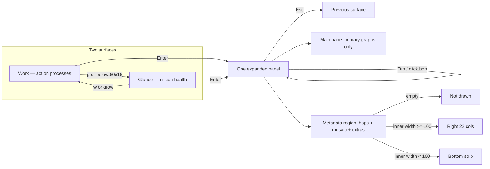

# Dashboard UX rewrite, pass 2 — one fact, one home

| | |
| --- | --- |
| **Status** | Draft |
| **Author** | plottypus design lead |
| **Date** | 2026-08-27 |
| **Audience** | Senior engineers implementing against this repo |
| **Companion law** | [`docs/UI-DESIGN.md`](../UI-DESIGN.md), [`docs/research/05-product-design.md`](05-product-design.md), [`docs/research/06-product-critique.md`](06-product-critique.md), [`docs/research/08-dashboard-ux-rewrite.md`](08-dashboard-ux-rewrite.md) |
| **Code freeze** | Design only. Do not implement from this file until the first PR in the plan is opened. |
| **Predecessor** | [`08-dashboard-ux-rewrite.md`](08-dashboard-ux-rewrite.md) shipped at `cc23f36`. This is the post-use rewrite. |

The user trained a run on the cockpit we just shipped and sent it back. This document is the product + engineering plan for the next pass. It is a critique first and a spec second. Locked input from the user is treated as product law, not a suggestion.

Honesty constraints are unchanged. Two surfaces only. Crate direction unchanged (`core ← {metrics, ui} ← bin`).

---

## Overview

Pass 1 gave us the right bones: `grid::pack`, cluster load histories, zone graphs, related hops, 250 ms cheap samples, shaped downsample. Pass 1 also painted the same fact two and three times, dumped leftover height into the usage band until `cpu` / `super` / `performance` became cathedrals, and shipped a CPU-expand "fan" hop that is a package-°C spark with no RPM.

This pass has one job: make the training-run glance answer three questions in three seconds, with each fact living in exactly one place. Usage graphs get shorter (Band 0 = **4** packer rows, leftover never lands there). Cluster strips die. The fan hop shows `2140 rpm` or `0 rpm`. Secondary facts move into one metadata region — a right column when the expanded inner is wide enough, a bottom strip when it is not, and nothing when the region would be empty.

---

## Background & Motivation

### Who just used it

Same persona as pass 1: trains ML models on Apple Silicon. They now have interiors. The interiors lie by repetition. They asked for four locked things:

1. Shorter hero graphs on CPU expand (`cpu`, `super`, `performance`).
2. Fan hop must show RPM, including idle `0 rpm`.
3. No redundant cards on one screen.
4. A metadata place for secondary facts so the main pane stays graphs.

### What shipped (pass 1, verified in tree)

| Layer | Reality | File |
| --- | --- | --- |
| Packer | `pack` assigns `min_height`, honors `grow_to`, **dumps every leftover row into the first `CellKind::Graph` band** | `crates/plottypus-ui/src/widgets/grid.rs` 114–124 |
| Graph min | `graph_spec` is 16×5; `resolve_kind` keeps Graph at height ≥ 5, Spark at 3–4 | `expanded.rs` 112–125, `grid.rs` 188–196 |
| CPU bands | 0 usage (cpu+clusters) / 1 zones / 2 hops / 3 strips (`grow_to: 8`) | `expanded.rs::cpu_bands` |
| Fan hop spec | title value `peak_fan → "{rpm} rpm"` | `expanded.rs` 254–260 |
| Fan hop paint | `ID_HOP_FAN` shares the `paint_temp(..., cpu_temp_history)` arm with `ID_PACKAGE` and `ID_HOP_SENS` | `expanded.rs` 666–668 |
| Fan hop title at paint | `label_for(ID_HOP_FAN) = ("fan", None)` + `history.last()` formatted as `{c:.0}°` | `expanded.rs` 829, 851–858 |
| `peak_fan` | `.filter(\|r\| *r > 0)` — present-but-idle is `None` | `expanded.rs` 1242–1250 |
| Cluster strips | same `%` as Band 0; `paint_strip` appends the same zone °C Band 1 already shows | `expanded.rs` 886–897 |
| Mosaic | not fill-bars: `S0  81%` text columns, only when strip cell height ≥ 8 | `expanded.rs` 931–958 |
| Compact SENS | title is package °C + rpm; spark is `cpu_temp_history`; headline is `e/p/s` | `fans.rs` |
| Compact MEM | 1-row used-ratio **bar** plus used-ratio **graph** | `mem.rs` 65–79 |
| Cadence / rings | 250 ms cheap, 3600-cap, `downsample_shaped` on the shared draw path | `history.rs`, `app.rs` |
| Braille | 4 levels / half-cell, 2 samples / column, bias 0.3 on 1-row | `braille.rs` |
| Panel name | compact title `"sens"`; `Panel::Fans::label()` is `"fans"` (expanded chrome uses the latter) | `layout.rs` 34, `fans.rs` 63, `expanded.rs` 1110 |

Worked leftover at the sizes the user actually has:

| Terminal | Expanded body | Inner | CPU mins (hops on, mosaic grow) | Leftover after grow | Band 0 height today |
| --- | --- | --- | --- | --- | --- |
| 80×24 | 80×23 | 78×21 | 5+5+3+5 = 18, cluster → 8 | 0 | **5** |
| 100×30 | 100×29 | 98×27 | 18, cluster → 8 | 6 | **11** |
| 160×50 | 160×49 | 158×47 | 18, cluster → 8 | 26 | **31** |

Pass 1's own worked pack (`08` §3) predicted this: "leftover 26 → Band 0 height 31." That was written down as if it were a feature. It is the cathedral.

---

## Surface critique

Every surface, compact and expanded. Severity is about a trainer's 3-second glance, not taste.

### Compact Work

Four tiles plus the process table. Membership is still right. Interiors are not.

**CPU** (`widgets/cpu.rs`). Title `cpu  62%  [busy]  [W]  71°  [fair]`. Body is the overall usage graph. Spec line (SoC, `12P + 6S`, MHz) hides at `Degrade::Minimal`, which is the 80×24 Work state (left rail 36 cols). Slack still goes to the hero row. **Good.** The graph is the story; the title is the number. Specs are correctly secondary.

**GPU** (`widgets/gpu.rs`). Same grammar. Title carries `%` and GPU °C. Specs (`16c`, MHz, ANE) hide at Minimal. **Good.**

**MEM** (`widgets/mem.rs`). Title `mem  28 / 48G  ●`. Then a **fill bar of used/total** and a **graph of the same used-ratio**. Two paintings of one number. The bar is the title, drawn again. At inner height 1 (Glance) the bar is the only body and earns its row. At Work mid-tile inner ≥ 2 the graph is the story. **Do not split: the graph gets the full body.** Glance inner 1 keeps the bar.

**SENS** (`widgets/fans.rs`). Title `sens  71°  2140 rpm`. Headline `e 48°  p 62°  s 71°`. Spark of `cpu_temp_history` (package). The `71°` in the title is very often the same token as the CPU title's `71°` (`cpu.temp_c` / `sensors.cpu_c` / `best_cpu_c`). Related context would be *which zone* and *are the fans up*. Package °C in the SENS title is a duplicate, not context. Headline `e/p/s` is the useful breakdown. Spark of package shape is the useful trend. **SENS title drops package °C whenever a fan is present.** Title becomes `sens  2140 rpm` (or both rpms, already implemented). If there are no fans, title is `max(e_c, p_c, s_c)` as `{tag} {c:.0}°` (tie-break S → P → E). If those are all `None`, fall back to today's `title_temp` as `{c:.0}°` with no zone letter.

RPM in the title is listed once per fan (`1200 rpm  1850 rpm`). That is correct for compact — two numbers, no graph to hide behind. Do not collapse to `max` here.

**NET.** Title has iface + rates; body is rx with a 1-row tx. **Fine.** Not on the trainer's first three questions, opt-in-adjacent, leave it.

**DISK** (off by default, `Config.show_disk = false`). Title is volume used/total; body is a used-ratio bar plus an I/O graph. Two stories in one opt-in tile. Acceptable because it is off by default and the user did not ask to redesign disk. Do not promote it.

**PROC.** The act surface. No new rail. **Correct.**

### Compact Glance

CPU hero absorbs slack. gpu/mem, net/disk, sens pin as 3-row strips. Glance SENS inner is 1 row of `e/p/s` + rpm — pass 1 was right to refuse a spark here. After the SENS title change, Glance SENS title is `sens  2140 rpm` and the inner row still answers "which zone." CPU title still carries package °C. **No Glance layout change.**

### Expand CPU — the failure case

```
outer title:  cpu  62%  71°  fair          ← overall % and package °C
Band 0:       cpu  62% | super  81% | performance  48%     ← overall % again
Band 1:       super zone  71° | perf zone  62° | package  68°
Band 2:       gpu  88%  →  |  fan   71°  →                 ← BUG: °C, no RPM
Band 3:       super  81%  71° | performance  48%  62°      ← same % and same °C
              S0  81% S1  …                                ← mosaic trapped in the duplicate
```

Count the copies on one screen:

| Fact | Copies on CPU expand today |
| --- | --- |
| Overall CPU % | outer title + Band 0 `cpu` title |
| Super % | Band 0 title + Band 3 strip title |
| Performance % | Band 0 title + Band 3 strip title |
| Super °C | Band 1 title + Band 3 strip title |
| Performance °C | Band 1 title + Band 3 strip title |
| Package °C | outer title + Band 1 `package` |
| GPU % | Band 2 hop (token — allowed) |
| Fan RPM | **zero**. The hop is a temp spark. Title value set in `cpu_bands` is dead: `paint_temp` overwrites it. |
| Live cores | Band 3 only, and only because leftover grew the *duplicate* strip to 8 |

**Broken symmetry.** Band 0 is `cpu | super | performance`. Band 1 is `super zone | perf zone | package`. Super usage is not above super heat. The trainer cannot read a column.

**Wasted height.** At 80×23 Band 0 is 5 (legal, still 20% taller than requested). At 100×30 it is 11. At 160×50 it is 31. Three side-by-side 31-row Mach-% cathedrals restating the strips below them. Meanwhile zone graphs — the slow series that *benefit* from vertical resolution — stay locked at 5.

**Empty / lying rectangle.** The fan hop is the information-inconsistency bug the user named. `ID_HOP_FAN` is in the temp arm. Idle 0 rpm is filtered out by `peak_fan`.

**Mosaic craft.** `render_core_grid` prints `S0  81%` in columns. That is a spreadsheet of the same `%` the graph already told. A trainer wants "are the Super cores alive or is one stuck." That is a glyph field, not 18 percentages.

### Expand GPU

```
outer:  gpu  88%  64°
Band 0: gpu  88%          ← leftover dump lands here
Band 1: gpu temp  64°
Band 2: cpu  62%  → | sens  71°  →
```

Title `%` + Band 0 title `%` is the hero grammar (one story, number in the chrome). Allowed. GPU °C in the title and in the graph is the same grammar as CPU package — the graph is the home, the title is the token. Allowed.

Hops are tokens + sparks of series this screen does not own. Allowed.

Leftover-into-util is less offensive than leftover-into-three-cluster-graphs, but the same policy should apply: **short usage, tall heat.** Util may grow a little (one hero); leftover after that goes to `gpu temp`.

`16c` / MHz / ANE are not cells today (good, K10 of pass 1). They belong in the metadata region when `Some`.

### Expand SENS

```
outer:  fans  71°  2140 rpm     ← name is "fans"; compact said "sens"
Band 0: super zone | perf zone | package | gpu temp
Band 1: Fan 1  2140 rpm | Fan 2  1850 rpm     ← RPM correct
Band 2: cpu  62%  → | gpu  88%  → | readings
```

Fan graphs are the one hop-destination that already does RPM right (`paint_fan`, `Scale::FAN`). `paint_fan` then **overdraws a fill-bar on the last plot row**, covering the newest braille with a ratio the title already stated. Kill the overlay.

Hops of CPU/GPU % are tokens. Allowed. They should move to the metadata region so Band 2 stops competing with fans for height.

`readings` listing leftovers after named zones is correct and is metadata.

Outer title uses `panel.label()` = `"fans"`. Compact, hop labels, and UI-DESIGN all say `sens`. **Broken identity.** Lock `sens`.

Package graph belongs here (SENS is heat-and-air). GPU die graph belongs here as heat, *and* on GPU expand as the GPU's die. That is two screens, two primaries — allowed. Do not also put GPU die on CPU expand.

### Expand MEM

Band 0 used graph (`22 / 36G`). Band 1 composition bars (wired / compressed / app) — **different facts, keep.** Band 2 is `proc  →` painted by `paint_titled_empty`. A 3-row bordered cell whose body is blank. That is the empty-rectangle law, as written, failing. The hop is a verb, not a graph. It belongs in the metadata region as a one-line hop, or as a title token, not as a hollow spark.

### Expand NET / DISK

Down/up and read/write graphs are one-story and clean. Volume list is metadata. The NET→DISK hop spark is allowed. `series_title` for `ID_HOP_DISK` prints **read** bps while `disk_bands` titled the hop with **combined** I/O (`expanded.rs` 541–545 vs 804). Minor inconsistency; fix when hops move to meta (title = combined, spark = `disk_history`).

`ID_HOP_NET` paints `net_rx_history` only. Acceptable for a hop token.

### Expand PROC

Table + dossier. Not a packer panel. No machine graphs. **Leave it.**

### Graph craft

Shipped: 4-level braille, two samples per cell, 250 ms cheap, `downsample_shaped` (10 s identity on a 40-col / 80-bucket plot), `Scale::LOAD/TEMP/FAN`, small-value bias. The line already *moves*. The user saying "smoother still" after that stack is not a request for lerp. It is a request that the graphs they stare at stop being 31-row step-functions of Mach % and start being the well-sized plots the packer was supposed to produce.

Biggest visual win in this pass, by a lot: **stop dumping leftover into Band 0.** A 2-row-inner braille usage plot (cell height 4) has 8 vertical steps and reads as a spark-or-short graph. A 9-row-inner zone plot has 36 steps on a band scale — that is where smoothness is spent. Tweening remains forbidden. 100 ms is not the default and is not in this pass (see What NOT to do).

---

## Goals & Non-Goals

### Goals

- One fact, one home, on each screen. Hop *tokens* (and hop sparks of a series this screen does not own) are allowed. Hop *graphs of a series that already has a graph on this screen* are not.
- Cluster load graphs XOR cluster strips. Graphs win. Mosaic leaves the strip and becomes a glyph field in metadata.
- CPU usage band is 4 packer rows at every size. Leftover never fattens it.
- Fan hop paints `Scale::FAN` + fan history + `fan  2140 rpm` / `fan  0 rpm`.
- One metadata grammar, responsive placement, hidden when empty.
- Work and each silicon expand answer at most three trainer questions (named below). Everything else is cut or demoted.
- Graphs get better by layout and by not lying. No interpolation.

### Non-goals (this design)

- IOReport, scaled-vs-busy, live MHz, PSTR watts, throttle marks, ANE as a tile.
- Per-core temperature, per-core history graphs, per-pid GPU, voltage.
- New surfaces, new compact panels, five presets.
- Tween / lerp / column-hold / dual-ink overlay of % and °C.
- 100 ms sample default, or a new interval step, in this pass.
- Fan control, battery, Intel-first layouts.
- Changing crate direction. `layout` importing `widgets`. A second size brain (`ExpandedDegrade`).
- A metadata region on compact Work. The process table is the act surface.

---

## Key Decisions

These are locked by this document.

### K1 — One fact, one home

Published redundancy map is law. A fact has one **primary card** (graph, bar, table, or compact tile). It may also appear as a **one-token title** on a hop, or as a token on the outer panel title of the screen that owns it. It may not appear as a second graph or a second strip of the same series on the same screen.

Hop tokens are allowed. Hop graphs of a series that already has a graph on that screen are not. A hop spark is allowed only when that series is *not* already graphed on the screen (the hop is then the only place the series appears).

### K2 — Kill the double cluster

Cluster load graphs stay. Cluster strips (`ID_SUPER_STRIP` / `ID_PERF_STRIP` / `ID_EFF_STRIP`, Band 3 of `cpu_bands`) are deleted. Live-core mosaic moves to the metadata region when `show_cores`. There is no second row of bars that restates the graph.

### K3 — Usage band is 4 rows, leftover does not go there

CPU Band 0 `min_height = 4`, `max_height = 4`. `resolve_kind` keeps `Graph` at height ≥ 4 (today 5). Inner height 2 = 2-row braille, 8 vertical steps.

Leftover policy (replaces `grid.rs` 114–124 "first Graph band"):

1. Honor `grow_to` (PR 2 only: cluster strips still `grow_to: 8`). After PR 3 deletes strips, **`Band.grow_to` is unused.** Mosaic 3→8 is not a packer band; it lives entirely in `split_meta`.
2. Dump remaining leftover into each band with `take_leftover == true`, in band order, each clamped by `max_height`.
3. CPU usage sets `take_leftover = false` and `max_height: Some(4)`.
4. If no band accepts leftover, leftover is unused (do not invent a blank spacer band).

This is the 15–20% cut the user asked for (5 → 4) **and** the cathedral fix (11 and 31 stop happening).

Usage cell height 4 ⇒ `cell_titled` inner 2. `render_scaled_graph` paints the `10%` / `45°` / `1.8k` corner hint only when `plot.height >= 3` (`chrome.rs` 167). **Usage graphs at 4 have no corner hint.** Accept that: `Scale::LOAD` is 0–floor and the title already carries `%`. Zone / fan / GPU-temp graphs stay min 5 (inner ≥ 3) and keep the hint. Do not raise usage back to 5 to recover it (Alt B stays rejected).

Odd row heights (UI-DESIGN §4: 3/5/7 for rounded-border symmetry) are **repealed for expanded cells.** PR 5 must delete that sentence. Compact Work slack may still prefer odd hero rows; the packer does not.

### K4 — One metadata grammar, responsive placement

Not per-card. Not per-minimized-state. Not a third surface.

**One region**, owned by expanded paint, not by `grid::pack`. Placement is a function of `(inner, budget, panel_mins)`, not width alone.

`panel_mins` is the sum of the panel's remaining graph-band `min_height`s (CPU: 4, plus 5 if any zone cell is present; GPU: 5, plus 5 if die-temp is live; SENS: 5 if any zone/package/gpu-temp is live, plus 5 if any fan is present; MEM/NET/DISK: 5). `split_meta` **reserves `panel_mins` first**, then spends leftover height on the strip.

`hops_h` is exclusive: **Spark = 3**, **LabelOnly = 1**, **Absent = 0**. Never add 3 for `proc →`.

| Condition | Placement |
| --- | --- |
| `budget` empty, or `inner` is 0, or right-rail height `< hops_h` (and no mosaic/volumes that fit) | Do not draw the region. Main pane is the full inner. |
| `inner.width >= 100` and budget nonempty and `inner.height >= hops_h.max(1)` | **Right column, 22 cols.** 1-col gap. Main is the rest. Height is *not* stolen. |
| `inner.width < 100` and budget nonempty | **Bottom strip**, height from the algebra below. |

Bottom-strip height (after reserving `panel_mins`). **Mosaic and Spark hops stack** — evaluate every matching row and sum heights. Mosaic +5 only when `inner.height >= panel_mins + hops_h + 5`, then also +3 when Spark hops match. Spark / Volumes-only / LabelOnly remain mutually exclusive by their `Take when` predicates. LabelOnly never takes the Spark row.

| Want | Take when | Height |
| --- | --- | --- |
| Mosaic (5) | `budget.mosaic` and `inner.height >= panel_mins + hops_h + 5` | +5 |
| Spark hops (3) | `budget.hops == Spark` and `inner.height >= panel_mins + 3` | +3 |
| Volumes-only (4) | `budget.volumes` and hops absent and mosaic absent and `inner.height >= panel_mins + 4` | +4 |
| LabelOnly (1) | `budget.hops == LabelOnly` and mosaic/volumes absent and `inner.height >= panel_mins + 1` | +1 |
| Else | — | meta `None` |

80×23 CPU (`panel_mins=9`, Spark + mosaic, inner 21): mosaic +5 and Spark +3 → **meta 8**, main 13. That pack is law.

Spark hops are a 3-row `cell_titled` + 1-row spark. **LabelOnly (`proc  →`) is a 1-row dim `Paragraph`, not `cell_titled`.** `cell_titled` is `Block::bordered()` (`chrome.rs` 68–74); height 1 has no inner, and a 3-row LabelOnly cell is the empty rectangle this pass kills.

Worked boundaries (CPU, `panel_mins = 9`, hops + mosaic wanted):

| Inner | Meta | Main | Why |
| --- | --- | --- | --- |
| 78×13 | hops 3, mosaic **off** | 78×10 | 13 ≥ 9+3, 13 < 9+3+5 |
| 78×16 | hops 3, mosaic **off** | 78×13 | 16 < 17; one short of mosaic |
| 78×17 | hops 3 + mosaic 5 | 78×9 | exact fit: 4+5+3+5 |
| 78×21 | hops 3 + mosaic 5 | 78×13 | 80×23 reference |

A literal “hops+mosaic ⇒ meta 8” at height 13 would leave main 5, `pack` would pop zones, and CPU expand would lose Q2. The reserve-mins rule is what prevents that.

Not on the left (graphs are the verb; facts follow). Not on compact Work. Not on Glance. Expanded PROC does not grow one.

Content priority (high → low), omit a section when it has nothing:

1. Related hops: Spark = text + 1-row spark in a 3-row `cell_titled`. `proc →` is LabelOnly — one dim line, no spark, no border.
2. Core mosaic when `show_cores` and this is CPU expand.
3. Identity / extras only when the region is the **right column**: SoC name, E+P+S counts, MHz/ANE if `Some` **and not already in the outer title**, swap/cache if nonzero, leftover sensor readings, volume list. **Watts stay on the CPU/GPU outer title** — they do not repeat in the rail.

Bottom strip at 80 cols does **not** grow a SoC essay. Hops + mosaic only (or volumes-only / `proc →` as above).

### K5 — Fan hop is a fan

Dedicated paint path. Never `paint_temp`. `Scale::FAN`, `theme.fan`, `Axis::Number`, the peak-fan history (the `fan_histories` slot whose live `rpm` is currently max; if tied, lowest index). Title:

- one present fan: `fan  2140 rpm` or `fan  0 rpm`
- two or more: `fan  max 2140 rpm` or `fan  max 0 rpm`

`peak_fan` no longer filters `> 0`. Present-but-idle is `Some(0)`. Absent hardware is `None` and the hop cell is `present: false`.

History slot: `fn peak_fan_index(view) -> Option<usize>` — index of the live max `rpm`; **lowest index on a tie**; `None` if `!fans.is_present()`. Spark uses `fan_histories.get(i)` only when `i < fan_histories.len()` (`push_fans` keeps 4 rings; a 5th fan can be the peak with no ring). Otherwise title + blank body.

SENS fan *graphs* already do RPM. They drop the fill-bar overlay.

### K6 — Three trainer questions, then stop

**Work compact**

1. Is the job on the GPU or the CPU? → CPU % graph vs GPU % graph.
2. Is memory about to kill the job? → MEM used/total + pressure + used-ratio history.
3. Is it cooking / are the fans up? → SENS rpm title + `e/p/s` headline + temp spark.

Process table answers *who* and is the act. It is not a fourth health question.

**Expand CPU**

1. Which cluster is doing the work? → Super / Performance / Efficiency **graphs only**.
2. Is that cluster cooking? → the matching zone graph, **column-aligned**.
3. Are the fans keeping up? → fan hop in metadata, with RPM.

Overall `%` lives in the outer title. It does **not** get a graph on this screen **when at least one Super / Performance / Efficiency cluster is present** (it is a function of those graphs). **Fallback:** if no cluster is present (`!has_cluster` for all three — default fixture, Linux stubs, first tick, untyped Intel cores), Band 0 is a single `ID_CPU` usage cell at height 4 / `take_leftover: false`. Empty Band 0 is not allowed. Package °C lives in the outer title as a token; the package **graph** lives on SENS.

**Expand GPU**

1. Is the GPU the hot path? → util graph.
2. Is the die cooking? → gpu temp graph.
3. Is the CPU sharing the load? → cpu hop in metadata.

**Expand SENS**

1. Which zone is cooking? → zone graphs, plus package.
2. Are the fans up? → per-fan RPM graphs.
3. Is this CPU or GPU heat? → hops in metadata (`cpu  62%`, `gpu  88%`).

Cut anything that does not serve those. Candidates that lose: overall CPU graph on expand, cluster strips, package graph on CPU, GPU-util *graph* on CPU (token+spark in meta is enough), empty `proc` spark, SENS title package °C, MEM compact bar-when-graph, fan fill-bar overlay, `S0  81%` spreadsheet mosaic.

### K7 — Graph craft without lying

Implement, in order of visual return:

1. Leftover policy (K3). This is the smoothness.
2. Usage cell height 4 → 2-row braille (no corner hint; see K3). Zone cells keep min 5 and eat leftover up to their `max_height`. SENS fans eat leftover only after zones hit their cap (K3 walk + §3 cap).
3. Align CPU usage columns with zone columns (drop overall `cpu` graph when clusters exist, and `package` graph on CPU).
4. Kill the fan-graph fill-bar overlay.
5. Mosaic becomes a glyph field (one stained cell per core), not percentages.

Reject: lerp, column-hold, dual-ink %/°C overlay, 8-level "braille" (the font has 4 dots per half-cell), 100 ms default, faster HID/SMC.

Draw cadence stays "on snapshot or input." Cheap default stays 250 ms.

### K8 — Paint owns titles

`cpu_bands` setting `CellTitle.value` for the fan hop is dead code. `paint_temp` / `series_title` / `paint_strip` recompute titles from `id`. That split is how the fan bug shipped. Rule: **`paint_*` is the only title source.** Band specs carry `id`, `kind`, `present`, `hop`, `min`, `weight`. Drop unused `value` strings from specs, or stop recomputing in paint — pick paint. Tests assert the painted buffer.

### K9 — The panel is called `sens`

`Panel::Fans::label()` returns `"sens"`. Compact, expand, hops, and UI-DESIGN agree. Enum name `Fans` stays (rename is churn, not product).

### K10 — Pass 1 decisions that still hold

Two surfaces. No kitchen-sink compact. No per-core histories. No tween. No IOReport placeholders. No `ExpandedDegrade`. `Degrade` still means spec lines only. Honesty law intact. Hop rings unchanged (`cpu ↔ gpu ↔ sens`, `net ↔ disk`, `mem ↔ proc`).

---

## Information architecture

Two surfaces. Panel order unchanged: `cpu · gpu · mem · net · disk · sens · proc`.



### Redundancy map — one fact, one home

| Fact | Primary home | May also appear as | Must not appear as |
| --- | --- | --- | --- |
| Overall CPU % | Work compact CPU graph + title; CPU expand Band 0 `ID_CPU` **only** when no Super/Perf/Eff cluster is present | CPU expand **outer title**; hop token on GPU/SENS | CPU expand Band 0 graph **when any cluster is present**; any strip |
| Super / Perf / Eff % | CPU expand cluster **graph** | (none on the same screen) | Cluster strip; compact title; hop graph |
| Per-core live load | CPU expand metadata **glyph mosaic** when `show_cores` | (none) | `%` spreadsheet; second strip; per-core history |
| Package °C | SENS expand package **graph**; Work compact CPU title token | SENS compact spark (shape); SENS/CPU outer title token | CPU expand package graph; SENS compact title when fans exist |
| Zone °C e/p/s | CPU expand zone **graphs** (aligned); SENS expand zone **graphs** (SENS is the heat screen) | Work/Glance SENS headline numbers | Strip titles; a third graph on the same screen |
| GPU % | Work compact GPU + GPU expand util graph | Hop token+spark on CPU/SENS | A GPU util *graph* on CPU/SENS main pane |
| GPU °C | GPU expand temp graph **and** SENS expand gpu-temp graph (two screens, two primaries: die vs heat-and-air) | GPU compact title token | CPU expand |
| Fan RPM | SENS expand per-fan **graphs**; Work compact SENS title | CPU expand hop token+spark (`Scale::FAN`) | A temp spark titled "fan"; hidden at 0 |
| Thermal word | CPU compact/expand outer title when ≠ nominal | (none) | A cell |
| CPU / GPU watts | CPU/GPU **outer title** when `Some` (already painted today) | Compact CPU/GPU title | Right-rail identity; a watts cell |
| MHz / ANE | Right-rail extras when `Some` **and not already in the title** | Compact spec line (`Degrade`) | Outer title (they are not there today); empty cell |
| MEM used / total / pressure | Work compact MEM + MEM expand used graph | PROC table mem column | A second used-ratio bar next to the graph |
| MEM composition | MEM expand bars | Compact spec line when `Degrade` allows | CPU/SENS |
| Swap / cache | Metadata (right column) if nonzero | Compact spec line | A hero graph |
| NET rx/tx | NET expand graphs + compact | Hop token on DISK | CPU/SENS |
| DISK I/O | DISK expand graphs | Hop token on NET | Compact title (title stays capacity) |
| DISK volumes | DISK expand metadata / list | Compact title primary volume | A used-ratio graph (I/O is the graph) |
| Process table | Work right + PROC expand | MEM metadata hop `proc →` | In-expanded CPU table |
| SoC name / E+P+S | Compact CPU spec (`Degrade`) | CPU expand metadata, **right column only** | A cell on the main pane |

Cross-screen duplicates of a *graph* (zone °C on CPU and on SENS; GPU die on GPU and on SENS) are intentional: each screen's primary question needs them. Cross-screen duplicates of a *token* are hops. Same-screen duplicates are bugs.

---

## Proposed Design

### 1. Packer leftover and usage height

`crates/plottypus-ui/src/widgets/grid.rs`:

```rust
pub struct Band {
    pub min_height: u16,
    pub max_height: Option<u16>, // Some(4) on CPU usage; None = uncapped
    pub grow_to: Option<u16>,
    pub take_leftover: bool,
    pub cells: Vec<CellSpec>,
}
```

`max_height` is applied after `grow_to` and after leftover. CPU usage: `min_height: 4, max_height: Some(4), take_leftover: false`.

`resolve_kind`:

```rust
CellKind::Graph if height >= 4 => Some(CellKind::Graph),  // was 5
CellKind::Graph | CellKind::Spark if height >= 3 => Some(CellKind::Spark),
```

`graph_spec` grows an overload, or CPU usage calls a `usage_spec` with `min: (16, 4)`. Zone/fan/mem/net/disk graphs stay `min: (16, 5)`.

Leftover walk, after `grow_to`:

```text
for band in live where take_leftover:
    give leftover, clamped by max_height
    leftover -= given
```

Do **not** fall back to `position(kind == Graph)`. That is the cathedral.

`grow_to` is live in PR 2 for cluster strips only. After PR 3, no band sets `grow_to`; mosaic height is decided by `split_meta` before `pack` runs. The packer does not place the rail.

### 2. Metadata region

New helpers in `crates/plottypus-ui/src/widgets/expanded.rs` (not `layout.rs` — no module cycle, same reason hops stay here):

```rust
struct MetaPlan {
    main: Rect,
    meta: Option<Rect>,
}

enum HopStyle {
    Absent,
    Spark,      // cpu / gpu / fan / disk / net — title + 1-row spark
    LabelOnly,  // proc → — title only, no spark
}

struct MetaBudget {
    hops: HopStyle,
    mosaic: bool,
    identity: bool,  // SoC, E+P+S; forced false on a bottom strip
    extras: bool,    // MHz/ANE if Some and not in title; swap/cache; readings
    volumes: bool,
}

fn split_meta(inner: Rect, budget: &MetaBudget, panel_mins: u16) -> MetaPlan;
fn meta_budget(panel: Panel, view: &AppView<'_>) -> MetaBudget;
fn panel_mins(panel: Panel, view: &AppView<'_>) -> u16;
fn paint_meta(frame, rect, panel, view, theme);
fn meta_hop_hit(rect, panel, view, col, row) -> Option<Panel>;
```

`budget` is empty when every field is off. `Volumes` and `HopNoSpark` are first-class (`volumes: true` / `hops: LabelOnly`), not implicit leftovers of “hops+mosaic+extras.”

`hop_hit` rebuilds the same `split_meta` + `pack` + `paint_meta` rects the paint path used. Spark hops hit-test their 3-row `cell_titled` rects. **LabelOnly hit-tests that one dim line** (`proc  →` → `Panel::Processes`). Today `hop_hit` only tests `pack(...).hop_at`.

`paint_meta` **must** call `paint_fan_hop` for a fan hop and `paint_series` for cpu/gpu/disk/net hops. It must not invent a second paint path (that is how `ID_HOP_FAN` became a temp spark). PR 3 therefore **hard-depends on PR 1**. LabelOnly is `frame.render_widget(Paragraph::new(...), one_row)` — never `cell_titled`, never `paint_titled_empty`.

Right column (inner.width ≥ 100, inner.height ≥ `hops_h.max(1)`): width 22, x = `inner.x + inner.width - 22`. Main width = `inner.width - 23` (1-col gap, no extra border around the gap). The meta region is **not** a second `panel_block`. Identity lines and LabelOnly hops are dim `Paragraph`s with no extra chrome. **Spark hops and mosaic** use `cell_titled`. LabelOnly does not.

Right-rail row budget, top to bottom (`paint_meta`):

| Section | Constraint | Notes |
| --- | --- | --- |
| identity | `Length(n)` | `n` = line count (SoC, `12P + 6S`); 0 if `identity` is false or dropped |
| extras | `Length(k)` | MHz/ANE/swap/cache/readings; 0 if omitted |
| each Spark hop | `Length(3)` | stacked; fan hop → `paint_fan_hop` |
| LabelOnly hop | `Length(1)` | `proc  →` dim `Paragraph`, **not** `cell_titled` |
| volumes | `Length(v)` or remainder | `v` = min(rows needed, leftover); omit if no room |
| mosaic | `Fill(1)` | min 3; omit if remaining height < 3 |

Hide order when the sum of mins exceeds rail height (drop first): extras → identity → volumes → mosaic → hops. If a Spark hop’s 3 rows do not fit, drop that hop. If LabelOnly’s 1 row does not fit, do not open the rail. `split_meta` refuses a right rail when `inner.height < hops_h` and nothing else in the budget fits.

Bottom strip: full inner width; height from the K4 table. Spark hops on top (3), mosaic below (5). LabelOnly-only is **1 row**, no stack. Volumes-only is a 4-row list with no hop row. Do not stack hops+volumes on the bottom strip — if both are wanted, Spark hops take the strip and volumes stay as the DISK packer `List` band.

Mosaic algebra (replaces `render_core_grid`):

```text
for each present cluster, left to right (S → P → E):
    dim tag ("S" / "P" / "E")
    one glyph per core in index order
    glyph = braille_cell(level, level) from that core's live scaled
    stain with GraphInk::Load(thermal) / theme.cpu
```

No `S0  81%`. A 12P+6S machine at 78×5 bottom mosaic is one tag + 6 Super glyphs, one tag + 12 Perf glyphs — readable as a heartbeat. At 22×N right rail, wrap to multiple rows (6–8 glyphs per row). `show_cores == false` omits the section; if hops are also absent, the whole region hides.

### 3. Per-panel Band contracts (pass 2)

Hops are **not** bands. Strips are **not** bands.

#### CPU — `cpu_bands`

| Band | min_h | max_h | leftover | Cells |
| --- | --- | --- | --- | --- |
| 0 usage | 4 | 4 | no | `ID_SUPER_LOAD` / `ID_PERF_LOAD` / `ID_EFF_LOAD` Graph 16×4, present if that cluster exists. **`ID_CPU` only as fallback** when none of the three is present. |
| 1 zones | 5 | None | yes | `ID_SUPER_ZONE` / `ID_PERF_ZONE` / `ID_EFF_ZONE` Graph 16×5, same left-to-right order as Band 0, present if that zone series is live. **No `ID_PACKAGE`.** |

Column alignment: Super usage over Super zone, Performance over Performance, Efficiency over Efficiency. If a cluster exists but its zone does not, that zone cell is omitted (rare on AS; accept a width shift). Do not insert a spacer cell (empty-cell law). When the `ID_CPU` fallback is the only usage cell, there is nothing to align; zones (if live) sit below it as a single row.

Metadata: hops `gpu` (if `show_gpu && gpu.is_some()`) and `fan` (if `show_fans && fans.is_present()` — **fans**, not `has_fans` which is also true for a fanless-but-sensored machine). Mosaic if `show_cores`. Identity (SoC, E+P+S) only in the right column. Watts stay on the outer title. MHz only in the rail if `Some` and not already titled.

Outer title unchanged in grammar: `cpu  62%  [W]  71°  [fair]  [busy if diverge]`. That is now the **only** overall-% and the **only** package-°C on this screen.

#### GPU — `gpu_bands`

| Band | min_h | max_h | leftover | Cells |
| --- | --- | --- | --- | --- |
| 0 util | 5 | 10 | yes, capped at 10 | `ID_GPU_UTIL` |
| 1 temp | 5 | None | yes | `ID_GPU_TEMP` if live |

Leftover order is band order: util may take up to 10, remainder to temp. Hops (`cpu`, `sens`) move to metadata. No hop band.

#### SENS — `sens_bands`

| Band | min_h | max_h | leftover | Cells |
| --- | --- | --- | --- | --- |
| 0 zones | 5 | **16** | yes | Super → Perf → Eff → package → GPU, present if live |
| 1 fans | 5 | **16** | yes (after zones hit 16) | up to 4 present fans, including `rpm == 0 && max_rpm > 0` |

K3 walks leftover in band order, clamped by `max_height`. Uncapped zones would swallow every row and leave fans at 5 forever (K7 overclaim). Cap **both** at 16: heat gets leftover first up to 16, then air grows, then leftover is unused. At 80×23 (main 18 after hops) leftover 8 < zone headroom, so fans stay 5 — heat is the story, air stays readable. At 160×49 both reach 16 (worked pack below).

Hops + readings move to metadata. Outer title: `sens  [hottest-zone or package token]  2140 rpm` (label fix). Peak rpm in the title includes `0`.

`paint_fan`: delete the `render_fill_bar` overlay. Title + `Scale::FAN` graph only.

#### MEM — `mem_bands`

| Band | min_h | max_h | leftover | Cells |
| --- | --- | --- | --- | --- |
| 0 used | 5 | None | yes | `ID_MEM` |
| 1 parts | 5 | None | no | wired / compressed / app if nonzero |

`ID_HOP_PROC` band deleted. Metadata: `proc  →` as **LabelOnly** — one dim `Paragraph` line, no spark, no `cell_titled` (there is no honest machine-series for "who"). `hop_hit` on that line returns `Panel::Processes`. Right column also gets swap/cache if nonzero. At 80×23 MEM (`panel_mins = 5` — used-graph min only; parts stay a packer `Cluster` band after the 1-row split): `split_meta` takes **meta height 1**, main **20**.

#### NET / DISK

Unchanged heroes. Hop cells move to metadata (`HopStyle::Spark`). DISK volumes: right rail extras when the rail is open; **volumes-only** bottom strip (height 4) when hops and mosaic are both off. If a NET hop *and* volumes are wanted on a narrow inner, hops take the 3-row strip and volumes stay as the packer `List` band — do not stack them on the bottom strip.

#### PROC

Unchanged.

### 4. Worked packs

Reference machine: **0E + 12P + 6S**, GPU present, two fans present, `s_c` / `p_c` / package live, no `e_*`, no watts, `show_cores = true`. Body sizes match pass 1 (`expand_fills_body`).

#### CPU at 80×23 — the required worked pack

Body `80×23`. `panel_block` inner `78×21`. `78 < 100` → **bottom metadata**.

`split_meta(78×21, hops+mosaic, panel_mins=9)`: 21 ≥ 9+3+5 → strip height 8. Main `78×13`.

Bands in main: usage min 4 max 4; zones min 5 leftover. `sum = 9 ≤ 13`. Leftover 4 → zones.

| Region | Rect (inner coords) | Children |
| --- | --- | --- |
| Band 0 usage | (0,0) 78×**4** | super (0,39)×4; performance (39,39)×4 — both `Graph` |
| Band 1 zones | (0,4) 78×**9** | super zone (0,39)×9; perf zone (39,39)×9 — both `Graph` |
| Meta hops | (0,13) 78×3 | gpu (0,39)×3; fan (39,39)×3 — Spark, fan title contains `rpm` |
| Meta mosaic | (0,16) 78×5 | glyph field, `S` + 6, `P` + 12 |

No `cpu` usage cell (clusters exist). No `package` cell. No `super` / `performance` strip. No Band 0 height > 4.

**Two packer tests, two PRs — do not collapse them:**

| Test | PR | Area | Expected |
| --- | --- | --- | --- |
| `grid::pack_cpu_80x23_reference` | **2** | 78×21, local `cpu_bands_hops` **with strips + hop band** | usage h=**4**, zones h=**6**, hops h=3, strips h=8. Arithmetic: mins 4+5+3+5=17, leftover 4, strip `grow_to` 8 uses 3, leftover 1 → zones. |
| `grid::pack_cpu_main_78x13_reference` | **3** | 78×13, post-cut `cpu_bands` (no hops, no strips) | usage h=**4**, zones h=**9**. No strip ids. |
| `expanded::split_meta_78x13_hops_only` | **3** | 78×13, hops+mosaic wanted, `panel_mins=9` | meta height 3, mosaic off, main 78×10 |
| `expanded::split_meta_78x16_still_no_mosaic` | **3** | 78×16, same budget | meta 3 (16 < 17), main 78×13 |
| `expanded::split_meta_78x17_mosaic_exact` | **3** | 78×17, same budget | meta 8, main 78×9, usage 4 + zones 5 |

A render test `expand_cpu_80x24_usage_band_is_4` paints 80×24 and asserts the usage cell height via `pack` (not by counting braille).

At 80×23 with `show_cores = false`: `split_meta` hops only (3). Main 78×18. Usage 4, zones 14.

At 80×23 with no GPU and no fans and `show_cores = false`: meta hidden. Main 78×21. Usage 4, zones 17.

#### CPU at 160×49

Inner `158×47`. `158 ≥ 100` → **right rail 22**, 1-col gap, main `135×47`.

Usage 4 + leftover 43 → zones **43**. (Main height 47.)

Rail 22×47, top to bottom: identity `Length(n)`, extras 0 (no MHz), gpu hop `Length(3)`, fan hop `Length(3)` (`paint_fan_hop`, title contains `rpm`), mosaic `Fill(1)`.

#### CPU at 60×15 (Stamp)

Inner `58×13`. `split_meta(..., panel_mins=9)`: 13 ≥ 12 hops, 13 < 17 mosaic → **hops 3, mosaic off**. Main `58×10`. Usage 4, leftover 1 → zones 6. Usage stays Graph at 4. No strip band to drop — already gone after PR 3.

#### GPU at 80×23

Inner 78×21, bottom meta hops 3 (`panel_mins = 10`). Main 78×18. Util min 5 max 10 leftover, temp min 5 leftover. Leftover 8: util takes 5 → **10**, temp takes 3 → **8**.

#### MEM at 80×23

Inner `78×21`. `budget.hops == LabelOnly`, no mosaic, no volumes. `hops_h = 1`. `panel_mins = 5` (used graph only; parts are not in `panel_mins`). `21 >= 5 + 1` → **meta height 1**, main **20**. The strip is one dim line `proc  →`. No 3-row cell. `hop_hit` on that row returns `Processes`. Parts remain a packer band in the main 20.

#### SENS at 80×23

Inner 78×21, bottom meta hops 3 (`panel_mins = 10`). Main 78×18. Zones min 5 max 16 leftover, fans min 5 max 16 leftover. Leftover 8 → zones **13** (under the cap), fans **5**. Heat is the story; air stays readable.

#### SENS at 160×49

Inner `158×47`. Right rail 22, main `135×47`. `panel_mins = 10`. Leftover 37.

| Band | min | max | After leftover |
| --- | --- | --- | --- |
| 0 zones | 5 | 16 | **16** (takes 11) |
| 1 fans | 5 | 16 | **16** (takes 11) |

Leftover 15 unused (K3 step 4). Both stories get a 16-row graph. Without the zone cap this would be zones 42 / fans 5 — a heat cathedral and dead air.

### 5. Fan hop implementation

`paint_pack` match arm today (`expanded.rs` 666–668):

```rust
ID_PACKAGE | ID_HOP_SENS | ID_HOP_FAN => {
    paint_temp(frame, cell, view.cpu_temp_history, theme);
}
```

Becomes:

```rust
ID_PACKAGE | ID_HOP_SENS => paint_temp(...),
ID_HOP_FAN => paint_fan_hop(frame, cell, view, theme),
```

```rust
fn peak_fan_index(view: &AppView<'_>) -> Option<usize> {
    if !view.snapshot.fans.is_present() {
        return None;
    }
    // lowest index on an rpm tie — do not use Iterator::max
    view.snapshot.fans.fans.iter().enumerate().min_by(|a, b| {
        b.1.rpm.cmp(&a.1.rpm).then(a.0.cmp(&b.0))
    }).map(|(i, _)| i)
}

fn peak_fan(view: &AppView<'_>) -> Option<u16> {
    Some(view.snapshot.fans.fans[peak_fan_index(view)?].rpm)
}

fn paint_fan_hop(...) {
    let Some(i) = peak_fan_index(view) else { return };
    let rpm = view.snapshot.fans.fans[i].rpm; // 0 is a real number
    let title = if view.snapshot.fans.fans.len() >= 2 {
        format!("max {rpm} rpm")
    } else {
        format!("{rpm} rpm")
    };
    // label "fan", hop arrow from cell.hop
    // Scale::FAN, theme.fan, Axis::Number, GraphInk::Flat
    // history = view.fan_histories.get(i) if i < len, else title + blank body
}
```

`FanSnapshot::is_present` is already `rpm > 0 || max_rpm > 0`, so idle-with-a-ceiling counts. Do not use `has_fans` (sensors-only machines) for the *fan* hop; a fanless Mac should not grow a `fan  0 rpm` spark of an empty ring.

If `fan_histories` is empty on the first sensor tick, still paint the title `0 rpm` / `2140 rpm` and leave the body blank (idle-empty law). Do not 0-fill a history to invent a line.

### 6. Compact de-dupe

**SENS title** (`fans.rs::title`):

1. If `present_fans` is nonempty: push per-fan `N rpm` only. **Do not** push package °C. PR 4 **rewrites** `title_temp_and_both_fans` (today it asserts `52°` in the title when fans exist).
2. If no fans: title is the hottest *named zone* among `e_c` / `p_c` / `s_c`, formatted `{tag} {c:.0}°` (`e` / `p` / `s`). Tie-break Super → Performance → Efficiency (training-run order, same as zone-graph drop-from-right).
3. If all three zones are `None`: fall back to today's `title_temp` (`cpu_c.or(temp_c).or(hotspot_c).or(gpu_c).or(readings.first)`) as `{c:.0}°` with **no** zone letter. Do not call that fallback a zone.

Headline `named_temps` and the spark stay. Glance inherits this (same function) and still has CPU title °C + SENS inner `e/p/s`.

**MEM bar** (`mem.rs`): when `body.height >= 2`, **do not split**. The used-ratio graph gets the full body — do not leave `rows[0]` blank after skipping `render_fill_bar`. When `body.height < 2` (Glance inner 1), keep the bar and no graph. Matches `compact_mem_no_bar_when_graph` (`━` / `─` from `render_fill_bar` must be absent on Work 80×24).

No new compact rail. No compact cluster numbers. No compact hop chips.

### 7. Graph craft details

Braille stays 4-level, 2 samples/cell, shaped downsample, 250 ms. The short usage plot is still `render_scaled_graph` (height 2 → braille, not the 1-row Sparkline). Hop sparks stay 1-row Sparkline (already more levels than braille). Zone/fan plots get the leftover rows — that is more stacked 4-level cells, which is real resolution, not fiction.

Axis hints stay on graphs whose inner height is ≥ 3 (`10%`, `45°`, `1.8k`). Usage at height 4 (inner 2) has **no** hint — accepted in K3. Thermal stain stays on **load** ink only.

Do not add a second downsample. Do not draw both samples of a 250 ms pair as a slope — braille already pairs them.

### 8. Files and ownership

| Change | Where |
| --- | --- |
| `Band.{max_height, take_leftover}`; leftover walk; Graph@4 | `widgets/grid.rs` |
| Band contracts; `paint_fan_hop` / `peak_fan_index`; delete strips; `ID_CPU` fallback only; drop `ID_PACKAGE` on CPU; `split_meta(inner, budget, panel_mins)` / `paint_meta` / mosaic glyphs; `hop_hit` includes meta | `widgets/expanded.rs` |
| `Panel::Fans::label() -> "sens"` | `layout.rs` (label only) |
| SENS title drops package °C when fans present | `widgets/fans.rs` |
| MEM bar only when no graph | `widgets/mem.rs` |
| `peak_fan` / idle 0 | `expanded.rs` |
| Fixture + render tests | `widgets/mod.rs` |
| UI-DESIGN / this file's successor path | docs, last PR |

No sampler, history, or cadence changes. `app.rs` hop rings stay. `plottypus-ui` still does not import metrics.

### 9. Tests that fail today, and the new ones

Today, if written against the locked product input:

| Test | Current result |
| --- | --- |
| `expand_cpu_fan_hop_contains_rpm` — painted CPU expand at 80×24 contains `rpm` in the hop cell | **FAIL.** Buffer has `fan` + a `°` from `cpu_temp_history`. Spec value `"2140 rpm"` never reaches `cell_titled`. |
| `expand_cpu_idle_fan_shows_0_rpm` — fans present, all `rpm = 0`, `max_rpm > 0` | **FAIL.** `peak_fan` is `None`; paint still shows °C. |
| `expand_cpu_no_double_cluster` — must not contain both a `performance` graph title and a second `performance` strip title with the same `%` | **FAIL.** Band 0 + Band 3. `expand_cpu_is_a_grid_of_cells` currently *requires* `E0`/`P0`, which only exist on the strip. |
| `pack_cpu_80x23_usage_height_is_4` | **FAIL.** Today's `pack_cpu_80x23_reference` asserts Band 0 height **5**; `pack_cpu_80x23_without_hops_grows_usage` asserts height **8**. After PR 2 the same test name asserts usage 4 / zones 6 / hops 3 / strips 8 on **78×21**. |
| `pack_leftover_skips_usage` at 78×21 with hops + strips | **FAIL.** Leftover walks to first Graph. |

New / rewritten tests (inline `#[cfg(test)]`, no `tests/` dir):

| Test | Asserts |
| --- | --- |
| `grid::pack_cpu_80x23_reference` **(PR 2)** | 78×21, hops+strips still present: usage h=4, zones h=6, hops h=3, strips h=8 |
| `grid::pack_cpu_main_78x13_reference` **(PR 3)** | post-cut bands, no hops/strips: usage h=4, zones h=9; no strip ids |
| `expanded::split_meta_78x13_hops_only` | mosaic off, meta 3, main 10 |
| `expanded::split_meta_78x16_still_no_mosaic` | 16 < 17, mosaic off |
| `expanded::split_meta_78x17_mosaic_exact` | meta 8, main 9 |
| `grid::pack_leftover_does_not_fatten_capped_band` | usage stays 4 when leftover is 20 |
| `grid::resolve_kind_graph_at_4` | height 4 → Graph, height 3 → Spark |
| `expanded::peak_fan_index_tie_is_lowest` | two fans at 2140, index 0 |
| `expanded::peak_fan_zero_is_some` | present idle → `Some(0)` |
| `render::expand_cpu_no_cluster_keeps_overall_graph` | fixture with no S/P/E still paints an inner `cpu` usage cell |
| `render::expand_cpu_typed_clusters_align` | P+S cores, no overall `cpu` graph cell; super.x == super-zone.x |
| `render::expand_cpu_fan_hop_shows_rpm` | `rpm` in buffer; not only `°` on that cell |
| `render::expand_cpu_idle_fan_shows_0_rpm` | `0 rpm` |
| `render::expand_cpu_no_double_cluster` | one `performance` title with the live %; no second strip bar row of the same % |
| `render::expand_cpu_80x24_no_overall_graph_cell` | when clusters exist: outer title has overall %; no inner cell titled `cpu  62%` as a Graph (the hop on other screens still may say `cpu`) |
| `render::expand_cpu_columns_align` | super load rect.x == super zone rect.x |
| `render::expand_cpu_mosaic_is_glyphs_not_percents` | `show_cores` on, 80×24: mosaic region has braille/stain; no `P0` percentage row |
| `render::compact_sens_title_prefers_rpm` | fans present: title has rpm, no package °C; headline still has `e`/`p`/`s` |
| `render::compact_sens_fanless_title_is_hottest_zone` | no fans, `s_c=71` `p_c=62` → title contains `s 71°`, not a bare package number |
| `render::compact_mem_no_bar_when_graph` | Work 80×24 MEM tile has braille and does not spend row 0 on a `━` bar |
| `render::expand_mem_has_no_empty_proc_spark` | no 3-row hollow `proc` cell; 80×24 MEM has a 1-row `proc  →` |
| `expanded::hop_hit_mem_labelonly_is_one_line` | click the dim `proc  →` row → `Some(Processes)`; a 3-row rect around it is not required |
| `layout::fans_label_is_sens` | `Panel::Fans.label() == "sens"` |
| existing honesty tests | still no `power` / `clock` / `E0 36°` |
| `visual_dump::dump_all_expanded` | paint 80×24 **and** 160×50 (today the ignored dump is 100×30 only) |

`expand_cpu_is_a_grid_of_cells` must be rewritten: it currently requires `"cpu"` as a cell, `"E0"`, `"P0"`, and both zone names. After this pass it requires cluster graph titles, zone titles, `rpm` on the fan hop, and must **forbid** a second `performance` strip.

### 10. What NOT to do

| Reject | Why |
| --- | --- |
| Lerp / tween / column-hold | Honesty. Pass 1 K7. |
| Dual-ink overlay of usage and °C | Different units, one lie. |
| 8-level braille | The glyph has 4 dots per half-cell. |
| 100 ms default or a new `[` `]` step | Self-CPU risk; leftover policy is the craft fix. Revisit only after this pass ships and the ignored bench is still < 2%. |
| Faster HID/SMC/process | Temps are 2 s physics. Do not fake thermal smoothness. |
| Per-core histories, per-core °C, per-pid GPU, voltage | No source, or already rejected. |
| Keep cluster strips "for the mosaic" | Mosaic moves. The strip's `%` is the graph. |
| Overall CPU graph *and* cluster graphs on expand | Overall is the mix when clusters exist. Title is enough. Fallback `ID_CPU` only when no cluster is present. |
| Package graph on CPU expand | SENS owns the package graph. Title token stays. |
| Always-on empty rail | Hide when empty. |
| Left rail | Graphs first. |
| Per-card metadata chips | Second grammar. |
| Compact Work rail | Process table is the act. |
| Third surface, kitchen-sink compact, new panels | Critique 06. |
| `ExpandedDegrade` | Packer + `split_meta` is the size brain. |
| IOReport placeholder cells | Empty-cell law. |
| Relabel Mach % as scaled | ROADMAP Phase 1. |
| `layout` imports `widgets` | Cycle. `split_meta` / `hop_hit` stay in `expanded.rs`. |
| Changing crate direction | ARCHITECTURE.md. |
| Painting `0.0` into a missing fan history so the hop has a line | Idle-empty. Title still says `0 rpm`. |
| Fan hop on a fanless-but-sensored machine | Hop is RPM, not "has sensors." |

---

## API / Interface Changes

No public crate API. Internal:

**Before** — `Band { min_height, grow_to, cells }`; leftover → first Graph; `ID_HOP_FAN` → `paint_temp`; `peak_fan` hides 0; CPU bands include overall + package + strips + hop band.

**After:**

```rust
pub struct Band {
    pub min_height: u16,
    pub max_height: Option<u16>,
    pub grow_to: Option<u16>, // PR 2 strips only; unused after PR 3
    pub take_leftover: bool,
    pub cells: Vec<CellSpec>,
}

struct MetaBudget {
    hops: HopStyle, // Absent | Spark | LabelOnly
    mosaic: bool,
    identity: bool,
    extras: bool,
    volumes: bool,
}

fn split_meta(inner: Rect, budget: &MetaBudget, panel_mins: u16) -> MetaPlan;
fn paint_fan_hop(frame: &mut Frame, cell: &Placed, view: &AppView<'_>, theme: &Theme);
fn peak_fan_index(view: &AppView<'_>) -> Option<usize>;
fn peak_fan(view: &AppView<'_>) -> Option<u16>; // Some(0) if present-and-idle
```

`Panel::Fans::label()` → `"sens"`. `CellKind` does not grow a `Meta` variant; the region is outside `pack`.

`event::Event` unchanged. `hop_hit` still returns `Option<Panel>`.

---

## Data Model Changes

None. No new history rings. No `Snapshot` fields. No config keys. `show_cores` already exists and now gates the mosaic section of the metadata region instead of the strip cell height.

`FanSnapshot::is_present` already treats `max_rpm > 0` as present. Do not change it.

---

## Alternatives Considered

### A. Keep leftover → first Graph; only lower Graph min to 4

Rejected. At 160×50 Band 0 becomes 30 instead of 31. The user named leftover dump as the bug.

### B. Cap usage at 5 and only stop leftover

Rejected as the *only* change. User asked 15–20% shorter. 5 → 4 is that cut. Combining cap-at-4 with leftover-skip is the pick. 5-with-no-leftover would still feel tall next to 9-row zones at 80×23.

### C. Always-on right metadata column, collapse below 100 to *nothing*

Rejected. At 80×24 — the daily size — mosaic and hops would have no home after strips die. That is how we get the double cluster back "just so the mosaic fits."

### D. Always bottom metadata strip

Rejected at 160×50: a full-width bottom essay under 43-row zone graphs is a wasteland, and identity/readings want to sit *beside* the graphs. Responsive placement is one grammar, two geometries.

### E. Left metadata column

Rejected. Reading order in this TUI is hero-then-facts. A left column makes the graphs feel like a sidebar.

### F. Per-card metadata footers

Rejected. Three different grammars, three leftover policies, and the same fact still gets a footer on every card. One region.

### G. Keep the overall `cpu` graph on expand

Rejected **when clusters exist**. It restates the outer title and is a weighted mix of the cluster graphs we already draw. Dropping it is what lets Super sit above Super zone. **Kept as the only Band 0 cell** when no Super/Perf/Eff cluster is present (Issue 4 / K6 fallback).

### H. Dual-ink overlay (usage + temp in one cell)

Rejected. Honesty. Two axes, one braille column, a prettier lie.

### I. 100 ms cheap collectors for smoothness

Rejected for this pass. 250 ms already moves the line. Self-CPU is the constraint we do not reopen while rewriting layout. If leftover+height-4 still feels stair-stepped, a later experiment can add 100 as a user step — not as a default, and not in the same PR as the packer.

### J. Keep strips as bar-only (no % in the title) for mosaic

Rejected. The bar *is* the last sample of the graph. K2.

---

## Security & Privacy Considerations

Unchanged. Local TUI, no network server, no sudo. This pass is paint and packer only.

- Hops still must not bind `x` outside PROC. `can_kill()` stays `expanded.is_none() || expanded == Processes`.
- Metadata must not grow a process list on CPU/GPU/SENS (that is Work).
- No new entitlements, no extra SMC/HID rate.

---

## Observability

- **Visual:** `visual_dump::dump_all_expanded` at 80×24 and 160×50. Run `--ignored --nocapture` before claiming a layout PR is done. The 80×24 dump must show usage height 4, aligned zone columns, and `rpm` on the fan hop.
- **Honesty:** existing empty power/clock tests stay. New tests above are the regression net for the fan bug and the double cluster.
- **Self-CPU:** unchanged ignored bench. This pass must not move the needle (no cadence change). If someone "slips" 100 ms into a layout PR, that is a review fail.

---

## Rollout Plan

No feature flags. Staged by PR (see PR Plan). Each PR is independently reviewable; main stays a working monitor.

Rollback: revert the PR. There is no config switch for leftover policy or the rail — those are the product.

Order rationale: ship the fan lie-fix first (trainer-visible, tiny). Then the packer contract (height + leftover) so later Band edits do not fight the cathedral. Then the one-fact-one-home rewrite (bands + meta + mosaic) as one product PR, because mosaic needs a home the moment strips die — and that PR **hard-depends on PR 1** so `paint_meta` can call `paint_fan_hop`. Compact de-dupe is independent and can land in parallel with the packer PR. Docs last.

---

## Open Questions

None that block implementation. The calls above are the product.

Not open: leftover target, usage height 4 vs 5, rail vs strip vs per-card, fan 0 rpm, double cluster, overall-cpu-graph on expand, package-graph on CPU, 100 ms, lerp, third surface, compact membership.

If the ignored self-CPU bench is already ≥ 2% on the reference M5 Pro from pass 1, that is a **cadence** follow-up, not a reason to keep cathedral graphs.

---

## Risks

| Risk | Severity | Mitigation |
| --- | --- | --- |
| 2-row usage braille feels like a spark, not a graph | Medium | 8 vertical steps + 39-col width after dropping the overall cell; zones beside them carry the "real graph" feel. Do not collapse Band 0 to Spark (keep `resolve_kind` Graph@4). |
| Mosaic-as-glyphs is less precise than `P0  81%` | Low | Precision lives in the cluster graph. Mosaic answers liveness. `show_cores` still toggles it. |
| Right rail at 100 cols makes 3-cluster machines tight | Medium | Reference is 2 clusters at 80 (39 each) and at 160 (67 each). A 3-cluster wide machine gets 22 stolen: `(inner-23)/3`. At inner 100, 25-col graphs, still ≥ 16. Below 100 we do not steal width. |
| `split_meta` steals mosaic height on a short inner | High | Reserve `panel_mins` first. Tests at 78×13 (hops 3, mosaic off) and 78×17 (exact mosaic). A 78×16 inner is still mosaic-off (16 < 9+3+5). |
| `hop_hit` forgets the meta split | High | One function builds the split for paint and hit-test. Test clicks the fan/gpu spark in the bottom strip *and* in the right rail. `paint_meta` calls `paint_fan_hop`. |
| Title/`paint_*` split regresses another hop | Medium | K8: paint owns titles. Fan test locks `rpm`. |
| Users who liked cathedral usage graphs | Low | They can widen the terminal; leftover now improves *heat*, which is the series that needs height. |

---

## References

- [`docs/UI-DESIGN.md`](../UI-DESIGN.md) — living contract
- [`docs/research/05-product-design.md`](05-product-design.md) — PRD
- [`docs/research/06-product-critique.md`](06-product-critique.md) — locked decisions (two surfaces, no kitchen sink, no tween)
- [`docs/research/08-dashboard-ux-rewrite.md`](08-dashboard-ux-rewrite.md) — pass 1, shipped
- [`crates/ARCHITECTURE.md`](../../crates/ARCHITECTURE.md)
- Code: `widgets/expanded.rs` (`cpu_bands`, `paint_pack`, `ID_HOP_FAN`, `peak_fan`, `paint_strip`, `paint_temp`, `paint_fan`), `widgets/grid.rs` (`pack` leftover, `resolve_kind`), `widgets/{cpu,gpu,mem,fans,net,disk}.rs`, `chrome.rs`, `braille.rs`, `spark.rs`, `layout.rs` (`Panel::label`), `core/src/history.rs` (`downsample_shaped`, `Scale::FAN`), `plottypus/src/app.rs` (histories, hops)

---

## PR Plan

Incremental. Main stays shippable. Do not sneak IOReport, 100 ms, or per-core histories into any of these.

### PR 1 — Fan hop is RPM

- **Title:** CPU fan hop paints RPM, including idle 0
- **Files / components:** `crates/plottypus-ui/src/widgets/expanded.rs` (`paint_pack` routing, `paint_fan_hop`, `peak_fan`); tests in `expanded.rs` / `widgets/mod.rs`
- **Depends on:** none
- **Changes:** Split `ID_HOP_FAN` off the `paint_temp` arm. Title `fan  2140 rpm` / `fan  0 rpm` / `fan  max 2140 rpm`. `Scale::FAN` + `peak_fan_index` (lowest index on tie; `fan_histories.get(i)` or blank body). `peak_fan` returns `Some(0)` when present-and-idle. Render test requires `rpm` on CPU expand. Do not change packer, strips, or compact.

### PR 2 — Packer: cap usage, leftover goes to heat

- **Title:** Usage bands stay 4 rows; leftover fattens zone/fan, not Band 0
- **Files / components:** `crates/plottypus-ui/src/widgets/grid.rs` (`Band.max_height`, `Band.take_leftover`, leftover walk, `resolve_kind` Graph@4); `expanded.rs` Band literals (`min_height: 4` + `max_height: Some(4)` + `take_leftover: false` on CPU usage; `take_leftover: true` on CPU zones; SENS zones `max_height: Some(16)` leftover yes; SENS fans `max_height: Some(16)` leftover yes; GPU util `max_height: Some(10)` leftover yes)
- **Depends on:** none (parallel with PR 1)
- **Changes:** The cathedral fix. Strips and the hop band **still exist** (strips still `grow_to` 8). No metadata region. Rewrite `grid::pack_cpu_80x23_reference` against the **local** `cpu_bands_hops` helper packing **78×21**: usage h=4, zones h=6, hops h=3, strips h=8. Replace `pack_cpu_80x23_without_hops_grows_usage` with `pack_leftover_does_not_fatten_capped_band`. Do **not** assert 78×13 / zones 9 here — that is the post-cut PR 3 fixture.

### PR 3 — One fact, one home + metadata region

- **Title:** Kill cluster strips; metadata rail/strip; align cluster columns
- **Files / components:** `expanded.rs` (new `cpu_bands` / `gpu_bands` / `sens_bands` / `mem_bands` / `*_bands` hop deletion; `split_meta(inner, budget, panel_mins)`, `paint_meta` calling `paint_fan_hop` / `paint_series`, LabelOnly as a 1-row `Paragraph`, glyph mosaic, `hop_hit` via the same split including that one line); tests in `widgets/mod.rs` and `expanded.rs` (`pack_cpu_main_78x13_reference`, `split_meta_78x13_hops_only`, `split_meta_78x16_still_no_mosaic`, `split_meta_78x17_mosaic_exact`, `expand_cpu_no_double_cluster`, column align, no overall CPU graph cell when clusters exist, `expand_cpu_no_cluster_keeps_overall_graph`, no empty proc spark, `hop_hit_mem_labelonly_is_one_line`, hop_hit on bottom strip *and* right rail)
- **Depends on:** **PR 1** (hard — `paint_meta` must call `paint_fan_hop`, not `paint_temp`) **and** PR 2 (packer contract)
- **Changes:** Delete Band 3 strips and hop bands. `ID_CPU` is fallback-only. Drop `ID_PACKAGE` from CPU expand. Mosaic + hops live in the metadata region (right 22 if inner ≥ 100 and height ≥ 3, else bottom height from the K4 algebra, hidden if empty). Super usage sits above super zone. Fan hop in meta **must** paint `rpm`. This is the product PR.

### PR 4 — Compact de-dupe

- **Title:** SENS title prefers RPM; MEM drops the bar when the graph is showing
- **Files / components:** `widgets/fans.rs`, `widgets/mem.rs`; render tests (`compact_sens_title_prefers_rpm`, `compact_sens_fanless_title_is_hottest_zone`, `compact_mem_no_bar_when_graph`); rewrite `title_temp_and_both_fans` so it no longer expects `52°` in the title when fans exist; Glance SENS still numbers
- **Depends on:** none (parallel with 1–2; fine beside PR 3)
- **Changes:** Work compact only. No rail. No expand changes. MEM: when inner ≥ 2, one vertical region — the graph — not a blank bar row plus a graph.

### PR 5 — Naming, fan overlay, docs, visual dump

- **Title:** Panel label is sens; stop covering fan graphs; update the contract
- **Files / components:** `layout.rs` (`Panel::Fans::label` → `"sens"`); `expanded.rs` `paint_fan` overlay deletion; `docs/UI-DESIGN.md` (IA table, slack policy for *expanded* leftover, metadata region, Graph min 4 for usage, **delete the odd-height 3/5/7 law** for expanded cells, note usage-at-4 has no axis hint); a short addendum pointer from `docs/research/08-dashboard-ux-rewrite.md` (do not rewrite 08); `docs/research/05-product-design.md` only if a sentence still claims leftover→hero on expand; `widgets/mod.rs` `visual_dump` at 80×24 and 160×50
- **Depends on:** PRs 3–4
- **Changes:** Docs + two leftover craft nits + the dump sizes. No new behavior beyond the overlay and the label.

Do not combine PR 2 with PR 3. Packer bugs and product-cut bugs must be separable. PR 2’s `pack_cpu_80x23_reference` is the **78×21 strips-still-on** fixture; PR 3 adds `pack_cpu_main_78x13_reference`. Do not put the fan paint fix inside PR 3 — merge PR 1 first so `paint_meta` can call `paint_fan_hop`.
